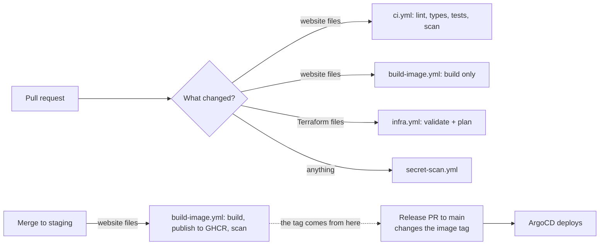

# GitHub Actions workflows

What runs, when, and why. (The site runs on Hetzner and is deployed by ArgoCD from git: see
`docs/infra/05-argocd-gitops.md`. The older AWS workflows are kept but run only by hand.)

## At a glance

| Workflow | Runs when | What it does |
|---|---|---|
| **`ci.yml`** (CI Pipeline) | Every pull request to `main` or `staging`; pushes to `main`, `staging` and `feature/**` (not docs-only pushes) | Decides what changed, then lints, type-checks, tests and security-scans the website **only if website files changed**. The paused AWS Terraform in `terraform/` is no longer validated here. **CI Summary** is the one check to require: it fails if any job failed, and accepts skipped ones |
| **`build-image.yml`** (Build and publish images) | Pull requests that touch website files; pushes to `staging` that touch website files; by hand ("Run workflow") | Builds the two container images (app and migrator). On a pull request it builds and **fails the check on any CRITICAL vulnerability that has a fix** (the gate; HIGH is reported after merge, not blocking, until the base image is clean). On a push to `staging` it **publishes both to GitHub's registry tagged with the commit** (`sha-<7 letters>`), **signs** each image (cosign, keyless; nothing enforces it yet), attaches an SBOM (list of contents) and build record, prints its **digest** in the run summary (the fingerprint a release should pin: `image: name:sha-abc1234@sha256:…`), and **scans the published image with Trivy** (findings under Security, reported but not blocking) |
| **`k8s-validate.yml`** (Validate Kubernetes manifests) | Pull requests and pushes (`main`, `staging`) touching `infra/k8s/**`; by hand | **kubeconform** checks every manifest against the Kubernetes API schema and **fails the check** on a bad one. **Checkov** lists security best-practice findings in the run summary and **does not block** (some are deliberate). Not a required check, because it only runs when `infra/k8s/**` changes |
| **`infra.yml`** (Hetzner Infrastructure) | Pull requests touching `infra/terraform/**`; pushes to `main` touching it; by hand | Formats and validates the Hetzner Terraform, shows a **plan** on pull requests, and on `main` offers an **apply that waits for approval** in the `hetzner-production` environment |
| **`secret-scan.yml`** | Every pull request; pushes to `main`, `staging` | Scans the whole history for committed secrets (gitleaks) |
| `terraform.yml` (old AWS) | Pull-request plans for `terraform/**`; by hand | The AWS Terraform plan and apply. **No longer runs automatically on `main`** |
| `deploy-app.yml` (old AWS) | By hand only | Builds and deploys to AWS ECS. **No longer runs automatically on `main`** |

## How the pieces fit

## Rules these files follow

- **A skipped job counts as passed; a missing check does not.** Pull requests always start `ci.yml`,
  and each job decides for itself whether to run. A path filter on the whole workflow would leave
  required checks "pending" forever.
- **One image build.** The website image is built (and scanned) only in `build-image.yml`; `ci.yml`
  has no build or Docker job.
- **Docs-only and infrastructure-only changes run almost nothing:** change detection, the secret
  scan and the summary. They build no image.
- **A merge to `main` is the deployment** (by promoting `staging`, after `scripts/release.sh prepare` has put the new image digest there).
  Nothing in these workflows deploys by itself.
- **Pinned actions.** Third-party actions are pinned to a commit so a changed tag cannot change what runs.

## Common questions

| Question | Answer |
|---|---|
| A pull request shows many "skipping" jobs | Expected: nothing those jobs cover changed |
| `Image (app)` failed fetching fonts | A temporary network problem on Google's side; re-run the failed job (`docs/infra/runbooks/02-troubleshooting-log.md`, B1) |
| Which commit has an image? | The newest one on `staging` that changed website files. A release uses that tag |
| An infrastructure "Apply" is waiting | Don't approve until the GitHub secret `TF_VAR_ADMIN_CIDRS` matches the real firewall (troubleshooting log, E1) |
| Where do Trivy findings appear? | GitHub: **Security** tab, **Code scanning**, category `trivy-app` or `trivy-migrator` |

## Pinned actions

Every `uses:` line names a full commit SHA with the version as a trailing comment (for example `actions/checkout@<40 characters>  # v4`). A version tag can be moved by the action's author; a commit SHA cannot. Dependabot reads the comment and proposes new SHAs weekly (into `staging`). Review those pull requests like any other dependency update.
