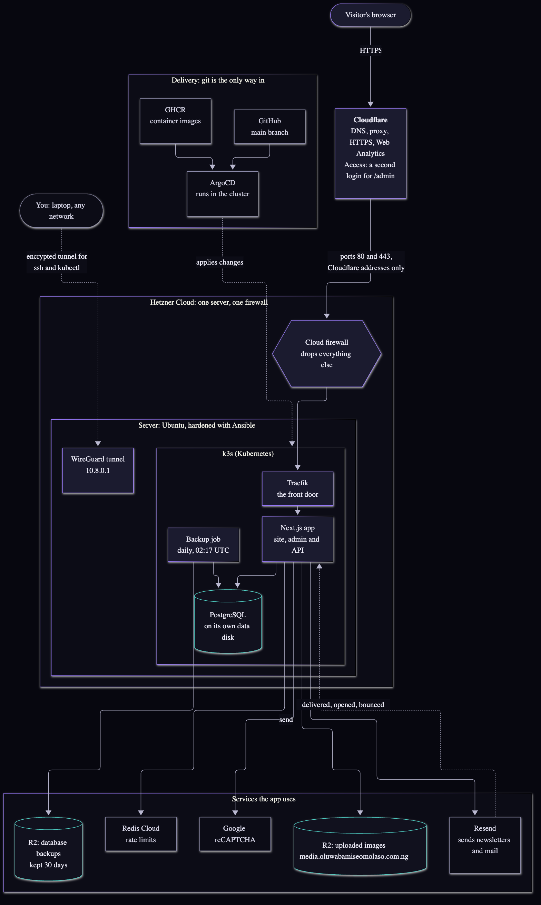
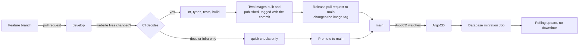
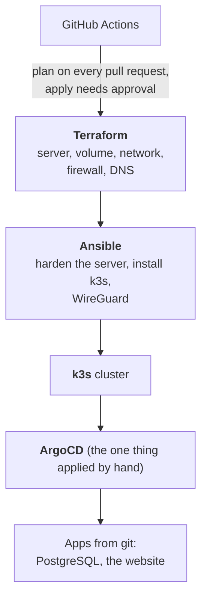

# Dr. Oluwabamise David Omolaso: portfolio, and the platform it runs on

[](https://github.com/BamiseOmolaso/cloudportfoliowebsite/actions/workflows/ci.yml)

**Live site: [oluwabamiseomolaso.com.ng](https://oluwabamiseomolaso.com.ng)**

A portfolio for a doctor turned cloud and DevSecOps engineer, **and** a demonstration of the
work: the site runs on a server that is built, hardened and deployed entirely from code in
this repository. Every layer is documented, including what broke.

> **Building or editing the site?** Read the [design and build guide](docs/DESIGN-GUIDE.md) first.
> **Looking for how the platform works?** Start at [docs/infra/00-architecture-overview.md](docs/infra/00-architecture-overview.md).

---

## Architecture



<sub>The same diagram as editable source: [docs/diagrams/architecture.mmd](docs/diagrams/architecture.mmd) (Mermaid). A vector version: [architecture.svg](docs/images/architecture.svg).</sub>

| Layer | What | Where it is described |
|---|---|---|
| **Edge** | Cloudflare: DNS, proxy, HTTPS, Web Analytics, and Access (a second login in front of `/admin`) | [04](docs/infra/04-domain-and-https.md), [08](docs/infra/08-domain-cutover.md) |
| **Firewall** | Hetzner cloud firewall: web ports accept **Cloudflare's addresses only**; one UDP port for the private tunnel | [01](docs/infra/01-terraform-hetzner.md), [11](docs/infra/11-wireguard.md) |
| **Server** | One Hetzner server, hardened with Ansible (key-only SSH, automatic security updates, fail2ban) | [02](docs/infra/02-ansible-harden-server.md) |
| **Kubernetes** | k3s with Traefik (front door) and cert-manager (HTTPS certificates that renew themselves) | [03](docs/infra/03-k3s-kubernetes.md) |
| **Delivery** | GitOps: ArgoCD applies what is in git; nothing is changed by hand on the cluster | [05](docs/infra/05-argocd-gitops.md) |
| **Data** | Self-hosted PostgreSQL on its own disk, a daily backup to object storage kept 30 days, and a restore that has been tested | [06](docs/infra/06-postgres.md) |
| **App** | Next.js 14 (site, admin panel and API) in a container | [07](docs/infra/07-the-application.md) |
| **Access** | A WireGuard tunnel for `ssh` and `kubectl`, so no home or VPN address has to be allow-listed | [11](docs/infra/11-wireguard.md) |

### How a change reaches the live site



- **A merge to `main` is the deployment.** `develop` is where work is collected and tested.
- Docs-only and infrastructure-only changes skip the website jobs and build no image.
- A database migration runs first, as an ArgoCD hook, before the new version starts.
- Rollback is reverting the release pull request.

### How the platform is built



Secrets (database password, API keys) are created by hand with prompts that never echo
them, live only in the cluster, and are **never in git**.

---

## The website

| Page | What it is |
|---|---|
| `/` | Landing page: hero, tools, numbers, featured projects, the platform with its diagram, how a change ships, patterns, latest posts, contact |
| `/projects`, `/projects/<name>` | Every project; the **Production platform on Hetzner** page explains this platform in three steps with a live diagram |
| `/blog` | Posts, including the "lessons learnt" write-ups of real incidents |
| `/learning` | The Terraform journey from one server to a production stack, and the infrastructure patterns |
| `/about`, `/contact` | Where I have worked and why a doctor; the contact form (with reCAPTCHA) |
| `/admin` | The admin panel (behind Cloudflare Access and its own login) |

**Admin panel:** edit the text of Home, About, Learning and Contact; show, hide and reorder
sections; write posts and projects with a rich editor and image upload (images go to Cloudflare R2); read
contact messages; manage subscribers (first names, join and unsubscribe dates); write and
send newsletters to chosen people, with a test copy and a delivery report (delivered, opened,
not opened, bounced, failed); and a cookie-free analytics page.

**Newsletter:** double opt-in (people confirm by email), per-address and per-visitor rate
limits, duplicate detection, unsubscribe links that never expire, and delivery tracking from
Resend's signed webhooks. **Analytics:** page views and load speed counted by the site itself, with no
cookies and no stored IP addresses.

## Tech stack

| Area | Tools |
|---|---|
| App | Next.js 14 (App Router), TypeScript, Tailwind CSS, Prisma, PostgreSQL, Tiptap, Zod, DOMPurify |
| Email and forms | Resend (with webhooks), Google reCAPTCHA v2, Redis Cloud for rate limits |
| Platform | Hetzner Cloud, Terraform, Ansible, k3s, Traefik, cert-manager, ArgoCD, WireGuard |
| Edge and storage | Cloudflare (DNS, proxy, Access, Web Analytics, R2 object storage) |
| Delivery | GitHub Actions (path-aware CI), GitHub Container Registry, GitOps through ArgoCD |
| Quality | Jest (over 400 tests), ESLint, TypeScript, gitleaks, and a design-rule test suite for the content |

## Documentation

| Doc | Topic |
|---|---|
| [DESIGN-GUIDE](docs/DESIGN-GUIDE.md) | Design rules, where content lives, how to add things, the checks to run |
| [00](docs/infra/00-architecture-overview.md) | The whole system in pictures |
| [01](docs/infra/01-terraform-hetzner.md) to [06](docs/infra/06-postgres.md) | Terraform, Ansible, k3s, domain and HTTPS, ArgoCD, PostgreSQL with backups and a tested restore |
| [07](docs/infra/07-the-application.md) | Building and deploying the app: images, migrations, secrets, the real visitor address |
| [08](docs/infra/08-domain-cutover.md) | Moving the real domain with no downtime |
| [09](docs/infra/09-site-structure-and-content.md) | Site structure, the admin panel, the newsletter system, analytics, abuse protection |
| [10](docs/infra/10-images-and-media.md) | Image uploads to Cloudflare R2 |
| [11](docs/infra/11-wireguard.md) | The private tunnel |
| [Runbooks](docs/infra/runbooks/) | [My IP changed](docs/infra/runbooks/01-my-ip-changed.md) and the [troubleshooting log](docs/infra/runbooks/02-troubleshooting-log.md) |
| [TODO](docs/infra/TODO.md) | What is done and what is next |

Each doc explains *why* before *how*, shows commands with each part explained, records
what was actually seen working, and ends with a glossary.

## Run it locally

You need Node.js 20 and a PostgreSQL database (a Docker container is fine).

```bash
git clone https://github.com/BamiseOmolaso/cloudportfoliowebsite.git
cd cloudportfoliowebsite
npm install
cp .env.example .env            # then fill in the values (names listed below)
npx prisma migrate deploy       # create the tables
npm run dev                     # http://localhost:3000
```

| Setting | Purpose |
|---|---|
| `DATABASE_URL` | PostgreSQL connection |
| `JWT_SECRET`, `ADMIN_EMAIL`, `ADMIN_PASSWORD` | Admin sign-in (use throwaway values locally) |
| `RESEND_API_KEY`, `RESEND_FROM_EMAIL`, `CONTACT_EMAIL` | Email (without a real key, sends fail but the site works) |
| `NEXT_PUBLIC_SITE_URL` | The site's address, used in links and emails |
| `NEXT_PUBLIC_RECAPTCHA_SITE_KEY`, `RECAPTCHA_SECRET_KEY` | reCAPTCHA v2 checkbox keys (without them, local development skips the check) |
| `R2_*`, `RESEND_WEBHOOK_SECRET` | Image storage and email delivery tracking. Optional: locally, images are saved under `public/uploads` |

Useful commands:

```bash
npm test                  # the test suite (with a coverage gate)
npm run type-check        # TypeScript
npm run lint              # ESLint
npm run build             # production build
```

Sample data for the admin screens (local only): `scripts/dev-seed-subscribers.sql`.

## Repository map

| Folder | Contents |
|---|---|
| `src/` | The website: pages, components, API routes, content, tests |
| `prisma/` | Database schema, migrations and seed SQL |
| `infra/terraform/` | Hetzner server, network, firewall and DNS as code |
| `infra/ansible/` | Server hardening, k3s, WireGuard |
| `infra/k8s/` | What runs on the cluster, applied by ArgoCD |
| `infra/scripts/` | Helper scripts (secrets, the laptop's WireGuard setup) |
| `docs/` | The documentation above, diagrams (`docs/diagrams`) and images |
| `terraform/` | The earlier AWS version of this site (paused; kept for reference) |

> **About AWS.** This site was first built for AWS (ECS Fargate, RDS, a load balancer) and is
> kept, paused, in `terraform/` and the older workflows, which now run only by hand. The live
> site runs on Hetzner.

## Security

The repository is public: no secrets, keys or addresses are committed (a secret scan runs on
every pull request). Web traffic reaches the server only through Cloudflare; the admin panel
sits behind Cloudflare Access and its own rate-limited login; user HTML is sanitised;
uploads are checked by their real contents; and the Content-Security-Policy lists only the
places the site loads from. Found a problem? Open a private security advisory on GitHub.

## License

No open-source licence is granted: all rights reserved. The code is public so it can be read and
learned from. The written content and projects are the author's own. Tool logos belong to their owners.
