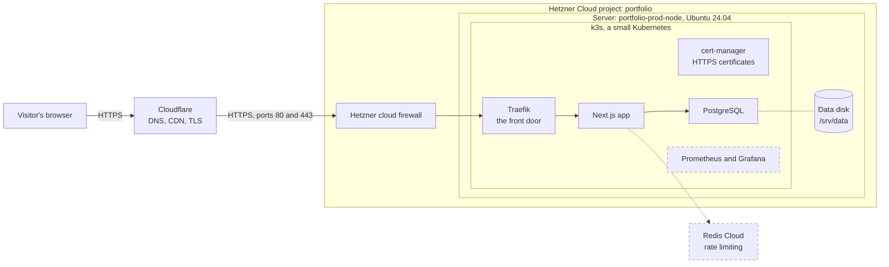
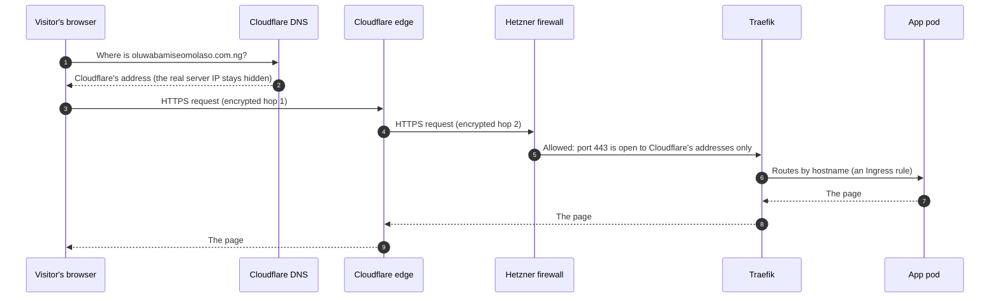
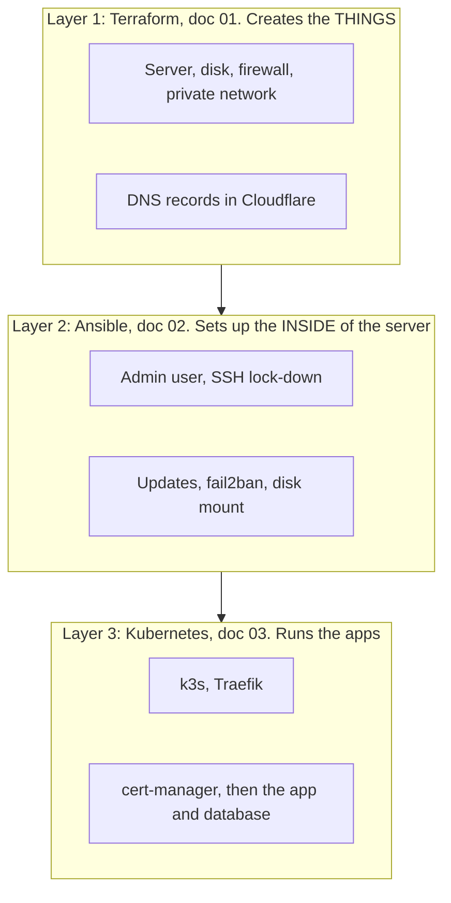
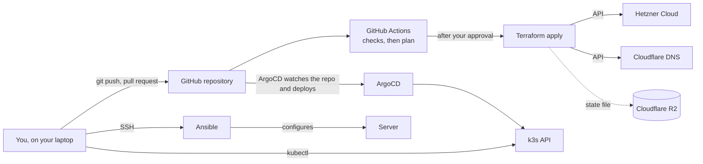
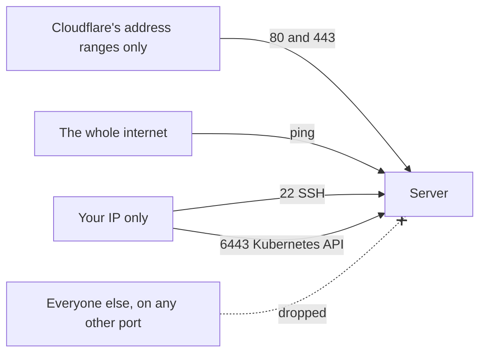

# 00 · Architecture overview: how everything fits together

Read this first. It explains the whole system in pictures, then each numbered doc
(01, 02, 03, ...) zooms into one part.

> **How to see the diagrams.** They are written in Mermaid, which GitHub draws
> automatically. In VS Code, install the extension **"Markdown Preview Mermaid
> Support"** and open the Markdown preview. Section 1 also has a plain-text
> picture that always works.

**Legend.** A solid box is **built and verified**. A dashed box is **planned or in
progress**, not yet seen working. We only call something "working" once we have
actually seen it work. (Today: the firewall, server, disk, k3s, Traefik, Cloudflare
routing, cert-manager, ArgoCD, PostgreSQL with backups, and the website itself are
verified, on a test hostname. Monitoring and the Redis connection are still to come.)

---

## 1. The big picture

The goal: a portfolio site that runs on infrastructure that is described entirely
in code, so it can be rebuilt from scratch, and whose cost stays small.

Plain-text picture (always visible):

```
 Visitor ──HTTPS──► Cloudflare ──HTTPS──► [Hetzner cloud firewall]
 (browser)          (DNS, CDN, TLS)                  │
                                                     ▼
 ┌─────────────── Hetzner Cloud project "portfolio" ───────────────────┐
 │  Server "portfolio-prod-node"  (Ubuntu 24.04, 2 vCPU / 4 GB)        │
 │  ┌───────────────────── k3s (Kubernetes) ────────────────────────┐  │
 │  │  Traefik (front door) ──► Next.js app ──► PostgreSQL          │  │
 │  │  cert-manager (HTTPS certificates)                            │  │
 │  │  Prometheus + Grafana (monitoring)             [planned]      │  │
 │  └───────────────────────────────────────────────────────────────┘  │
 │  Data disk (10 GB) mounted at /srv/data  ◄── database files         │
 └──────────────────────────────────────────────────────────────────────┘
                                                     │
                                     Redis Cloud (rate limiting) [existing]
```

The same thing as a diagram:



### What each part is for

| Part | Job | Why we chose it |
|---|---|---|
| **Cloudflare** | Holds the domain's DNS, shields and speeds up the site, does the visitor's HTTPS | Free, and hides the server's real address |
| **Hetzner firewall** | Drops unwanted traffic before it reaches the server | Runs outside the server, so a mistake on the server cannot switch it off |
| **Server** | The one machine everything runs on | Cheap; one node is enough for a portfolio |
| **k3s** | Runs and supervises containers | A real Kubernetes, small enough for 4 GB |
| **Traefik** | Receives web traffic and sends it to the right app | Bundled with k3s |
| **cert-manager** | Gets and renews HTTPS certificates automatically | No manual certificate renewals |
| **Data disk** | Holds the database files, separate from the server | The server can be rebuilt without losing data |

## 2. What path does a visitor's request take?



Steps 2 to 9 happen in a fraction of a second. We have proven the whole path with a
test page on `test.oluwabamiseomolaso.com.ng`: Cloudflare in front, a real Let's
Encrypt certificate on the server, and a pod answering (doc 04). The real app
replaces the test page later.

## 3. How the system gets built: who creates what

Everything is created by code, in layers. Each layer uses the one below it.



| Tool | Talks to | Remembers | Think of it as |
|---|---|---|---|
| Terraform | Hetzner and Cloudflare APIs | A state file in Cloudflare R2 | The builder who puts up the house |
| Ansible | The server over SSH | Nothing (checks each time) | The person who furnishes the rooms |
| kubectl and Kubernetes | The k3s API on port 6443 | The cluster's own database | The manager who keeps the apps running |

## 4. Where changes come from



Today you run Terraform, Ansible and `kubectl` from your laptop, and the CI pipeline
checks Terraform changes. ArgoCD now watches git and deploys the apps by
itself, so a change to the repo is the only way a change reaches the cluster. That
idea is called **GitOps**.

## 5. Who may connect to what (the firewall)



| Port | Used for | Who may reach it |
|---|---|---|
| 80 | Web (redirected to HTTPS) | Cloudflare only |
| 443 | Web over HTTPS | Cloudflare only |
| 22 | SSH (key only, no root, no passwords) | Your IP only |
| 6443 | Kubernetes API (`kubectl`) | Your IP only |
| Everything else | Nothing | Dropped |

A second layer exists on the server itself: SSH accepts keys only, and fail2ban bans
addresses that keep failing. Layers matter: if one fails, another still protects.

> **Why web ports are Cloudflare-only:** visitors must come through Cloudflare, so
> nobody can talk to the server directly and the visitor-address header
> (`CF-Connecting-IP`) can only come from Cloudflare (doc 07, section 7). Terraform
> reads Cloudflare's published ranges, so they stay current when you run it. **Every
> DNS record for this server must stay proxied (orange cloud)**: a grey-cloud
> record would be unreachable.

> **Consequence of "your IP only":** if your home IP changes, SSH and `kubectl` stop
> working until you update `admin_cidrs` in Terraform and apply.

## 6. Where is each piece of state kept?

State is the thing you cannot recreate from code, so it is the thing to protect.

| What | Where it lives | If lost |
|---|---|---|
| Terraform's record of what it built | Cloudflare R2 bucket | Terraform forgets the servers exist |
| Database data (planned) | The data disk | The site's content (so: back it up) |
| Cluster Secrets | The server (encrypted) | Re-create them |
| Your SSH key, kubeconfig, API tokens | Your laptop and password manager | Make new ones |
| All the code | Git | Nothing: it is the rebuild recipe |

Everything else (the server, the cluster, the apps) is **disposable**: it can be
destroyed and rebuilt from code. That is the point of the whole design.

## 7. Cost shape

| Item | Cost shape |
|---|---|
| Server and data disk | Billed hourly while they exist (also when powered off) |
| Public IPv4 address | Possibly billed on top; check the console |
| Cloudflare (DNS, CDN, TLS) | Free plan |
| Cloudflare R2 (Terraform state) | Free tier |
| Let's Encrypt certificates | Free |
| Redis Cloud | Existing free tier |

Check current Hetzner prices in the console; we do not quote numbers from memory.

## 8. Reading order

1. **00** this page
2. **01** Terraform on Hetzner: the server, firewall, disk, state
3. **02** Ansible: lock down and prepare the server
4. **03** k3s: Kubernetes, and a test page
5. **04** Domain and HTTPS: DNS, certificates, Cloudflare
6. **05** ArgoCD and GitOps: git becomes the only way a change reaches the cluster
7. **06** PostgreSQL on the data disk, with nightly backups to R2 and a tested restore
8. **07** the application: images, migrations, secrets, deploy (verified on the test hostname)
9. **08** the cut-over: moving the real domain to the new site (planned)
10. **09** how the site is organised and where each piece of content lives (built, not yet released)
11. Next: monitoring
