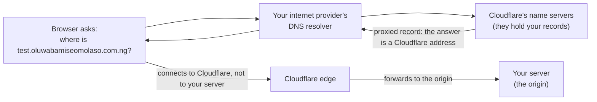
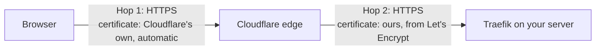
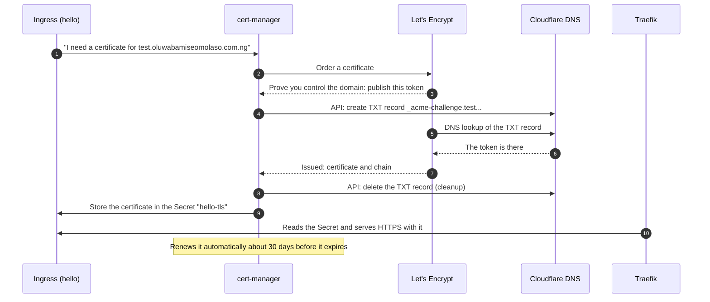
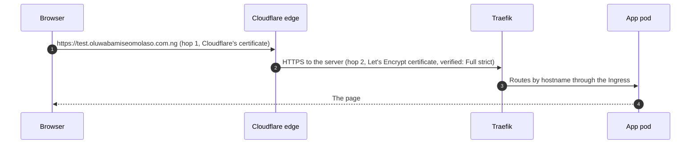

# 04 · Domain and HTTPS

In doc 03 a test page answered on the server's raw IP address over plain HTTP.
Real visitors use a name and expect the padlock. This doc connects your domain to
the cluster and gets HTTPS working, **on a test hostname first**, so nothing about
your real domain changes yet.

**What you will learn:** how DNS works, why there are two separate encrypted
connections when Cloudflare is in front, how certificates are issued and renewed
automatically, and how to debug the usual HTTPS failures.

Read `00-architecture-overview.md` first if you have not.

---

## 1. How a browser finds your site (DNS)

DNS is the internet's phone book: it turns a name into an address.



Each record has a **proxy** switch:

| Setting | What the world sees | Effect |
|---|---|---|
| **Proxied** (orange cloud) | A Cloudflare address | Hides your server's IP; adds TLS, caching, DDoS protection |
| **DNS only** (grey cloud) | Your server's real IP | Cloudflare only answers the lookup |

We proxy the web records. We never proxy mail or SSH records (Cloudflare's proxy only
carries web traffic).

**Why the test hostname?** Your bare domain still points at the old WordPress site.
A separate name, `test.oluwabamiseomolaso.com.ng`, lets us prove the whole path
without touching it. The cut-over of the real domain comes later, as its own step.

## 2. HTTPS with Cloudflare in front: two separate connections

When Cloudflare proxies a site, there are **two** encrypted connections, and each one
has its own certificate.



- **Hop 1** (browser to Cloudflare) is handled for you. Cloudflare issues a free
  certificate for your domain.
- **Hop 2** (Cloudflare to your server) needs a certificate **on your server**.
  Getting that is the work of this doc.

Cloudflare's **SSL/TLS mode** decides how hop 2 is treated:

| Mode | What it does | Verdict |
|---|---|---|
| Off | No encryption at all | Never |
| Flexible | Hop 1 encrypted, hop 2 plain HTTP | Unsafe: the last leg is readable |
| Full | Hop 2 encrypted, but any certificate is accepted (even self-signed) | Encrypted but not authenticated |
| **Full (strict)** | Hop 2 encrypted **and** the certificate must be valid | **What we use** |

Full (strict) is the only mode where an attacker cannot impersonate your server on
hop 2. It needs a real certificate on the server, which is why we set up cert-manager.

## 3. How a certificate is issued, automatically

A **certificate authority** (CA) vouches that a public key belongs to a domain.
**Let's Encrypt** is a free CA. It talks to software over a protocol called
**ACME**. The software we run in the cluster is **cert-manager**.

Before issuing, the CA must be sure you control the domain. It asks for a proof
called a **challenge**. There are two kinds:

| Challenge | Proof | Problem for us |
|---|---|---|
| HTTP-01 | Serve a token at `http://domain/.well-known/...` | Breaks when Cloudflare redirects HTTP to HTTPS or caches things |
| **DNS-01** | Publish a token in a DNS TXT record | Works behind a proxy; needs a Cloudflare API token |

We use **DNS-01**. cert-manager creates the TXT record itself through the Cloudflare
API, so it needs an API token.



### The Kubernetes objects involved

| Object | What it is |
|---|---|
| **ClusterIssuer** | "Here is a CA I can ask for certificates, and how to prove ownership." We make two: `letsencrypt-staging` and `letsencrypt-prod` |
| **Ingress annotation** `cert-manager.io/cluster-issuer` | "This Ingress wants a certificate from that issuer" |
| **Certificate** | Created for you from the Ingress; tracks one certificate and its renewals |
| **Secret** `hello-tls` | Where the certificate and private key are stored |
| **Secret** `cloudflare-api-token` | The API token cert-manager uses for the TXT records |

### Staging first, then production

- **Staging** certificates are not trusted by browsers, but staging has very generous
  limits. Use it to find mistakes cheaply.
- **Production** certificates are trusted, but Let's Encrypt **rate-limits repeated
  failures** (for example, too many failed orders in an hour). Fumbling in production
  can lock you out for a while.

So we always prove the process on staging, then switch.

### Why cert-manager and not a Cloudflare "Origin Certificate"?

Cloudflare can issue a 15-year certificate that only Cloudflare trusts. It is simpler
(no software to run) but is tied to Cloudflare forever, expires on a calendar you must
remember, and teaches less. cert-manager is the standard tool in Kubernetes, renews
by itself, and works with any host. We pay a little more complexity for that.

## 4. Two Cloudflare API tokens

We make **two separate tokens**, each limited to this one domain:

| Token | Used by | Why separate |
|---|---|---|
| `terraform-dns` | Terraform (and CI) to manage DNS records | If one leaks, revoke only that one |
| `cert-manager-dns01` | cert-manager inside the cluster for `_acme-challenge` TXT records | Different holder, different place it can leak |

**Create each:** Cloudflare dashboard → profile (top right) → **My Profile** → **API
Tokens** → **Create Token** → **Create Custom Token**.

- Permissions: **Zone → DNS → Edit** and **Zone → Zone → Read**
- Zone Resources: **Include → Specific zone → oluwabamiseomolaso.com.ng**
- Copy the token when shown (it is shown once). Put it in your password manager.

A token limited like this cannot touch billing, other domains, or anything but this
zone's DNS.

## 5. Step by step (you do these)

Work in this order. Each step has a check, and each lists what you should see.

### Step A: DNS record with Terraform

The `dns` module creates one record: `test` pointing at the server, proxied.

1. Get your **Zone ID**: Cloudflare dashboard → your domain → **Overview** → right-hand
   column → **Zone ID**. It is not a secret.
2. Put it in `infra/terraform/envs/prod/terraform.tfvars`:
   ```hcl
   cloudflare_zone_id = "paste-it-here"
   ```
3. In a terminal (secrets as in doc 01, section 6.0, plus the Cloudflare token):
   ```bash
   read -rsp "Paste terraform-dns token: " CLOUDFLARE_API_TOKEN; echo; export CLOUDFLARE_API_TOKEN
   cd infra/terraform/envs/prod
   AWS_SHARED_CREDENTIALS_FILE=/dev/null AWS_CONFIG_FILE=/dev/null terraform init -reconfigure -backend-config=backend.hcl
   AWS_SHARED_CREDENTIALS_FILE=/dev/null AWS_CONFIG_FILE=/dev/null terraform plan
   ```
   (`init` is needed again because we added a provider.)
4. **Read the plan.** Expected: `Plan: 1 to add, 0 to change, 0 to destroy`, one
   `cloudflare_dns_record` named `test`. If anything is changed or destroyed, stop.
5. `terraform apply`, then check the record exists:
   ```bash
   dig +short test.oluwabamiseomolaso.com.ng
   ```
   You should see **Cloudflare addresses, not your server's IP**. That is the proxy
   working. (It can take a minute to appear.)

### Step B: install cert-manager

```bash
export KUBECONFIG=~/.kube/hetzner-portfolio.yaml
kubectl config current-context          # must print: hetzner-portfolio
kubectl apply -f https://github.com/cert-manager/cert-manager/releases/download/v1.21.2/cert-manager.yaml
kubectl -n cert-manager get pods        # wait until all three are 1/1 Running
```

The version is pinned (`v1.21.2`). Before applying, glance at cert-manager's
supported-releases page to confirm it supports your Kubernetes version (1.35).

> Applying a manifest straight from a URL trusts that URL. The pinned release tag is
> fixed, which limits the risk. Later, ArgoCD will install cert-manager from your own
> repo instead.

### Step C: give cert-manager its API token

This Secret is created **by hand and never committed**: a token in git is a leaked
token.

```bash
read -rsp "Paste cert-manager-dns01 token: " CF_TOKEN; echo
kubectl -n cert-manager create secret generic cloudflare-api-token --from-literal=api-token="$CF_TOKEN"
unset CF_TOKEN
```

(The command text saved in your shell history contains `$CF_TOKEN`, not the value.)

### Step D: create the issuers

```bash
sed "s/REPLACE_WITH_YOUR_EMAIL/you@example.com/" infra/k8s/cert-manager/cluster-issuers.yaml | kubectl apply -f -
kubectl get clusterissuer
```

Use your real email: Let's Encrypt warns you there before a certificate would expire.
Both issuers should show `READY True` within a few seconds. If `False`, see the table
in section 7.

### Step E: serve the test page over HTTPS, on staging

```bash
kubectl apply -f infra/k8s/hello/hello.yaml
kubectl apply -f infra/k8s/hello/hello-https.yaml
kubectl -n hello get certificate -w
```

The second file replaces the plain Ingress with one that asks for a certificate.
Watch `READY` turn `True` (usually under two minutes; press Ctrl-C to stop watching).
To see progress or a failure:

```bash
kubectl -n hello describe certificate hello-tls
kubectl -n hello get challenges
```

Test straight against the server, bypassing Cloudflare (use your own server IP in place of `<server-ip>`) (`-k` because staging
certificates are not trusted):

```bash
curl -vk --resolve test.oluwabamiseomolaso.com.ng:443:<server-ip> https://test.oluwabamiseomolaso.com.ng/ 2>&1 | grep -iE "issuer|HTTP/|Hostname"
```

Expect an issuer line that mentions **STAGING**, `HTTP/2 200`, and `Hostname:` from the
test pod. The `--resolve` flag means "connect to this IP but use this name".

### Step F: switch to production

1. In `infra/k8s/hello/hello-https.yaml`, change `letsencrypt-staging` to
   `letsencrypt-prod` in the annotation, then re-apply.
2. Delete the staging certificate so a fresh one is issued:
   ```bash
   kubectl apply -f infra/k8s/hello/hello-https.yaml
   kubectl -n hello delete certificate hello-tls
   kubectl -n hello delete secret hello-tls
   kubectl -n hello get certificate -w
   ```
3. Run the same `curl` as in step E (without `-k` this time). The issuer should now be
   a real Let's Encrypt one, with no STAGING in it.

**What we saw:** the staging check showed `(STAGING) Ersatz Emmer YR2` with `HTTP/2
200`; after switching, the issuer was `CN=YR2` with `SSL certificate verify ok` and
`HTTP/2 200`. Section 7.1 decodes those lines.

### Step G: tell Cloudflare to verify the server's certificate

In the Cloudflare dashboard → your domain → **SSL/TLS**:

1. **Overview** → encryption mode → **Full (strict)**.
2. **Edge Certificates** → **Always Use HTTPS** → on.

Then check through Cloudflare, from your laptop and in a browser:

```bash
curl -I https://test.oluwabamiseomolaso.com.ng/     # HTTP/2 200, header "server: cloudflare"
curl -I http://test.oluwabamiseomolaso.com.ng/      # 301 redirect to https
```

In the browser you should see the padlock. (Real visitors only ever reach step G's
path; steps E and F test the origin directly.)

### Clean up the test page when you are done

```bash
kubectl delete -f infra/k8s/hello/hello-https.yaml
kubectl delete -f infra/k8s/hello/hello.yaml
```

Leave the test DNS record for now; it is harmless and the app will use a similar one.

## 6. What the final path looks like



## 7. Reading the output: what the codes mean

Most of working with infrastructure is reading output and knowing what it is telling
you. This section decodes everything we saw, plus the errors you will meet.

### 7.1 Our real results, line by line

This is the production check from step F:

```
* Hostname test.oluwabamiseomolaso.com.ng was found in DNS cache
* (304) (IN), TLS handshake, CERT verify (15):
*  issuer: C=US; O=Let's Encrypt; CN=YR2
*  SSL certificate verify ok.
* using HTTP/2
> GET / HTTP/2
< HTTP/2 200
Hostname: hello-6c55b69558-ccgms
```

| Line | What it means |
|---|---|
| `Hostname ... was found in DNS cache` | curl already knows which IP to use for that name. We forced it with `--resolve`, so it never asked DNS |
| `TLS handshake, CERT verify (15)` | Part of setting up the encrypted connection: the server proved it owns the certificate's private key. The `(15)` and `(304)` are internal message numbers; you can ignore them |
| `issuer: C=US; O=Let's Encrypt; CN=YR2` | Who signed the certificate. `C` is the country, `O` the organisation, `CN` the name of the signing certificate (Let's Encrypt's name for it changes over time). If `CN` contains **STAGING**, it is the test authority |
| `SSL certificate verify ok.` | curl traced the certificate up to an authority it trusts, and the name matches. This is what `-k` skips |
| `using HTTP/2` | The protocol version both sides agreed on (HTTP/2 is the modern one) |
| `> GET / HTTP/2` | A line starting with `>` is what **curl sent**: ask for the page `/` |
| `< HTTP/2 200` | A line starting with `<` is what **the server answered**. `200` means success (see 7.3) |
| `Hostname: hello-...` | The body of the reply. It is the name of the pod that answered, which proves the request reached our app |
| Lines starting with `*` | curl's own notes about what it is doing |

The `[HTTP/2] [1] [:authority: test....]` lines are the request headers. `:method` is
GET, `:scheme` is https, `:path` is `/`, and `:authority` is the host name you asked
for (that is how Traefik knows which Ingress rule applies).

And the staging result, for contrast:

```
*  issuer: C=US; O=Let's Encrypt; CN=(STAGING) Ersatz Emmer YR2
*  SSL certificate verify result: unable to get local issuer certificate (20), continuing anyway.
```

`(20)` means "I cannot trace this certificate to an authority I trust". That is correct
for staging, and `-k` ("continuing anyway") told curl to carry on regardless.

### 7.2 The curl flags we used

| Flag | Meaning |
|---|---|
| `-v` | Verbose: show the conversation (the `*`, `>`, `<` lines) |
| `-k` | Do not verify the certificate. Only for testing a staging certificate |
| `-I` | Ask for the headers only, not the page |
| `-s` | Silent: no progress meter |
| `-o /dev/null` | Throw the page body away |
| `-w "%{http_code}\n"` | Print just the status code afterwards |
| `-L` | Follow redirects |
| `--resolve name:443:IP` | "Use this IP for that name", skipping DNS. We use it to talk to the server directly, bypassing Cloudflare |

### 7.3 HTTP status codes (the number after `HTTP/2`)

The first digit tells you whose problem it is.

| Code | Name | Meaning |
|---|---|---|
| **200** | OK | Success |
| **301** | Moved permanently | Go to another address (our HTTP to HTTPS redirect) |
| **302** | Found (temporary redirect) | Go elsewhere for now |
| **304** | Not modified | Your cached copy is still good |
| **400** | Bad request | The request was malformed. (R2 answered `400` to our bare check: it reached R2, which just did not like an empty request, so it is a good sign.) |
| **401** | Unauthorized | You must log in |
| **403** | Forbidden | Logged in or not, you may not have this |
| **404** | Not found | No such page |
| **429** | Too many requests | Rate limited |
| **500** | Internal server error | The app crashed |
| **502** | Bad gateway | A proxy (Traefik) got no valid answer from the app |
| **503** | Service unavailable | Nothing healthy is behind the proxy right now |
| **504** | Gateway timeout | The app took too long |

Rule of thumb: **2xx** worked, **3xx** go elsewhere, **4xx** the request was the
problem, **5xx** the server was the problem.

### 7.4 Cloudflare's own error codes (52x)

When Cloudflare is in front, a failure between Cloudflare and your server shows as a
Cloudflare page with a 52x code. These all mean "Cloudflare is fine, the problem is
between it and your server (the origin)".

| Code | Meaning | Usual cause here |
|---|---|---|
| **520** | Empty or unknown response from the origin | The app or Traefik replied with garbage or nothing |
| **521** | Web server is down | Connection refused: Traefik not listening, or the firewall blocks 443 |
| **522** | Connection timed out | Server unreachable: firewall, wrong IP, or the server is off |
| **523** | Origin is unreachable | Wrong IP in the DNS record |
| **524** | A timeout occurred | The app connected but took too long to answer |
| **525** | SSL handshake failed | Traefik is not serving HTTPS for that host (check the Ingress `tls` block) |
| **526** | Invalid SSL certificate | Mode is Full (strict) but the origin certificate is staging, expired, or for another name |

### 7.5 curl's own errors (when there is no HTTP code at all)

If curl cannot even get an answer, it prints `curl: (N) ...` and the number tells you
the stage that failed. This is also why `000` appeared as the status code earlier.

| `curl: (N)` | Meaning | Where to look |
|---|---|---|
| **(6)** | Could not resolve host | DNS (this is the problem we had with the R2 address) |
| **(7)** | Failed to connect | Nothing is listening, or a firewall blocks the port |
| **(28)** | Timed out | Firewall silently dropping, or the server is down |
| **(35)** | TLS handshake failure | The server is not speaking HTTPS on that port |
| **(60)** | Certificate problem | The certificate cannot be verified (the cause is in the line above it) |

Certificate verify codes in brackets, such as `(20)`: **20** cannot trace to a trusted
authority, **18** self-signed certificate, **10** certificate has expired.

### 7.5b Response headers (what `curl -I` printed through Cloudflare)

`curl -I` asks for the headers only. These came back from `https://test...`:

| Header | What it means |
|---|---|
| `HTTP/2 200` | Success, over HTTP/2 |
| `server: cloudflare` | **Proof Cloudflare answered**, not your server directly. The proxy is in the path |
| `content-type: text/plain` / `content-length: 587` | The kind and size (in bytes) of the page: our test pod's plain-text reply |
| `cf-cache-status: DYNAMIC` | Cloudflare did not cache it (dynamic pages are not cached by default). `HIT` would mean it served a saved copy |
| `cf-ray: a4452d37...-LAX` | A unique ID for this request, ending with the three-letter code of the Cloudflare data centre that handled it (`LAX` is Los Angeles). Quote it when asking Cloudflare support about a request |
| `alt-svc: h3=":443"` | "I also speak HTTP/3 on this port": an offer to use the newest protocol next time |
| `report-to` and `nel` | Cloudflare's network-error reporting for browsers. You can ignore them |
| `date` | When the answer was produced |

And from `http://test...` (plain HTTP):

| Header | What it means |
|---|---|
| `HTTP/1.1 301 Moved Permanently` | "This has moved for good" |
| `Location: https://test.../` | **Where to go instead.** This is **Always Use HTTPS** at work: Cloudflare turns every plain-HTTP request into a redirect to HTTPS, before it ever reaches your server |

Two good habits: `curl -I` to see how a site is set up without downloading it, and
checking `server:` to know who answered.

### 7.6 Kubernetes status words

From `kubectl get pods`, `kubectl get certificate` and friends.

| What you see | Meaning |
|---|---|
| `READY 1/1` | 1 of 1 containers in the pod is ready. `0/1` is not ready yet |
| `Pending` | Waiting to be placed or started (often waiting for resources or an image) |
| `ContainerCreating` | Pulling the image and starting |
| `Running` | The container is up |
| `Completed` | A one-time job that finished successfully (the `helm-install-*` pods) |
| `CrashLoopBackOff` | The container keeps crashing; Kubernetes waits longer between restarts. Read `kubectl logs` |
| `ImagePullBackOff` / `ErrImagePull` | It cannot download the image: wrong name or tag, or no access |
| `RESTARTS 2` | How many times the container has restarted |
| Certificate `READY True` | The certificate was issued and is stored in its Secret |
| Certificate `READY False` | Not issued yet or failing: `kubectl describe certificate ...` |

cert-manager works through a chain of objects, and when a certificate is stuck you
walk down it to find where it stopped:

```
Certificate  ->  CertificateRequest  ->  Order  ->  Challenge
```

```bash
kubectl -n hello get certificate,certificaterequest,order,challenge
kubectl -n hello describe challenge <name>      # the reason is at the bottom, under Events
```

## 8. When things go wrong

| Symptom | Likely cause and fix |
|---|---|
| `kubectl get clusterissuer` shows `READY False` | `kubectl describe clusterissuer letsencrypt-staging`. Often the email still says `REPLACE_WITH_YOUR_EMAIL`, or the Secret `cloudflare-api-token` is missing from the `cert-manager` namespace |
| Certificate stays `READY False` | `kubectl -n hello describe certificate hello-tls`, then `kubectl -n hello get challenges` and `kubectl describe challenge ...` |
| Challenge: `403` or `Invalid request headers` from Cloudflare | The cert-manager token lacks **Zone → DNS → Edit** or is not limited to the right zone |
| Challenge pending a long time | DNS needs a moment to propagate; wait a few minutes, then check the TXT record exists (`dig TXT _acme-challenge.test.oluwabamiseomolaso.com.ng`) |
| `too many failed authorizations` / rate limit | You hit Let's Encrypt limits on production. Wait an hour; always test on staging first |
| Browser: **526 Invalid SSL certificate** | Mode is Full (strict) but the origin certificate is staging, expired or for another name. Finish step F |
| Browser: **525 SSL handshake failed** | Traefik is not serving HTTPS for that host: check the Ingress `tls` block and the Secret `hello-tls` |
| Browser: **522 / 521 connection timed out / refused** | Cloudflare cannot reach the server: check the Hetzner firewall allows 443 and that Traefik is running (`kubectl -n kube-system get pods`) |
| `dig` shows your real server IP | The record is not proxied (grey cloud); check the `proxied` setting |
| Terraform: `record already exists` | A record with that name is already in Cloudflare. Delete it in the dashboard or import it into Terraform |
| `terraform plan` shows more than 1 change | Stop. Something drifted; read it before applying |

## 9. Security notes

- Both API tokens are limited to **one zone** and **DNS only**. They cannot reach
  billing, other domains or account settings.
- The cert-manager token lives only in a cluster Secret (encrypted at rest by k3s,
  see doc 03). It is never in git.
- The Terraform token is in your shell and, later, a GitHub Actions secret.
- Revoke and re-create a token whenever you are unsure who has seen it.
- Full (strict) is on; Flexible is never used.

## 10. Cost

Nothing. Let's Encrypt, Cloudflare's free plan and cert-manager are free.

## 11. What comes next

`05` ArgoCD and GitOps (so everything after this is deployed from git), then `06`
PostgreSQL on the data disk with backups, then the app, monitoring, and the cut-over
of the real domain.
