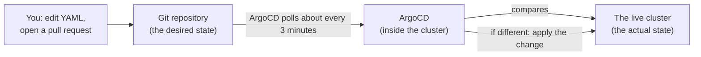
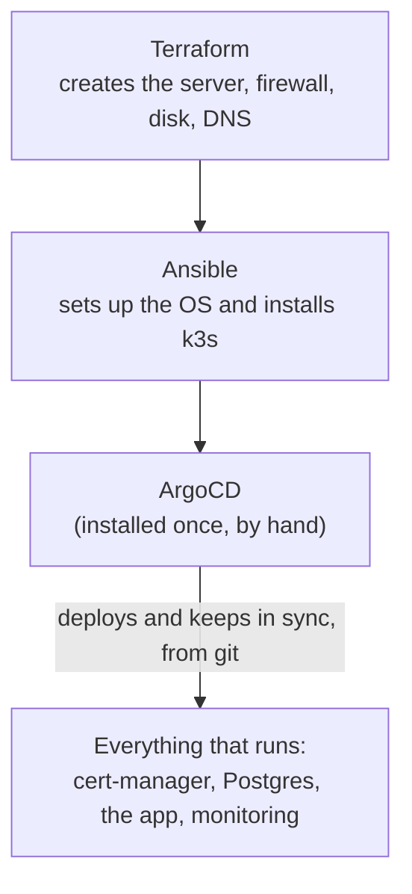
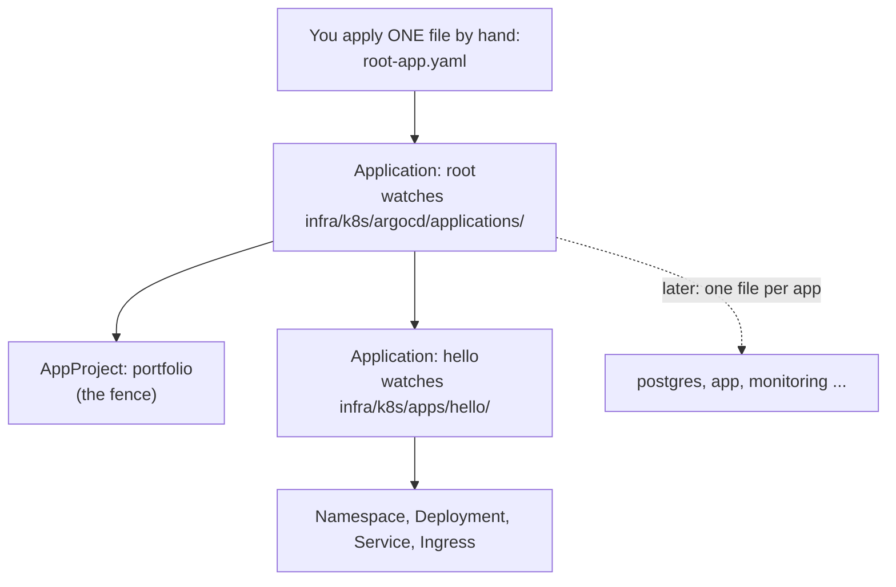

# 05 · ArgoCD and GitOps

So far we put things into the cluster by hand with `kubectl apply`. That works, but it
has a weakness: nothing stops the cluster drifting away from what is in git, and
nobody can tell from git alone what is actually running. **ArgoCD** removes that
weakness. After this doc, **git is the only way a change reaches the cluster.**

**What you will learn:** what GitOps is, how ArgoCD compares git with the cluster,
the "app of apps" pattern, what the status words mean, and how to watch ArgoCD heal
a manual change.

Read `00-architecture-overview.md` first if you have not.

---

## 1. The idea: git is the truth

Without ArgoCD, you are the delivery system:

```
you edit YAML  →  you run kubectl apply  →  cluster changes
```

If you forget to apply, or someone edits something in the cluster by hand, git and
reality disagree and nobody notices.

With ArgoCD, a program does the delivering and keeps checking:



This loop is called **reconciliation**: ArgoCD keeps asking "does the cluster match
git?" and fixes any difference. The whole approach is called **GitOps**.

What you get:

- **A record of every change:** the git history is the deployment history, with who
  and why.
- **Review before anything runs:** changes arrive through pull requests.
- **Self-healing:** a change made by hand in the cluster is undone.
- **Easy recovery:** rebuild the cluster, point ArgoCD at git, and everything comes
  back.
- **A dashboard** that shows what runs and whether it matches git.

## 2. Where each tool stops (a recap)



ArgoCD is the **last thing you install by hand**. After it, everything else is
deployed by ArgoCD.

## 3. How it is organised: the "app of apps" pattern

An ArgoCD **Application** says: "take the YAML at this place in git, and keep it
applied in that namespace". We will have many applications, so rather than applying
each by hand, we use one **root** application that creates the others.



To add an application later you just add a file to `infra/k8s/argocd/applications/`
and merge it. ArgoCD notices and creates it.

```
infra/k8s/
├─ argocd/
│  ├─ root-app.yaml              the one file applied by hand
│  └─ applications/
│     ├─ 00-project.yaml         the fence (an AppProject)
│     └─ hello.yaml              the test page application
├─ apps/
│  └─ hello/hello.yaml           the actual Kubernetes YAML ArgoCD deploys
├─ hello/                        the manual version from docs 03 and 04 (kept for the lessons)
└─ cert-manager/                 still applied by hand for now (see section 9)
```

### The AppProject: a fence

A **project** limits what its applications may do. Ours (`portfolio`) allows:

- only this one repository as a source
- only the namespaces listed under `destinations`
- creating Namespaces, and no other cluster-wide objects

So a mistake or a bad change cannot, for example, reach into `kube-system`. When we add
Postgres we add its namespace to that list, as a reviewed change.

### What the sync settings mean

In `hello.yaml`:

| Setting | Meaning |
|---|---|
| `automated` | ArgoCD applies changes by itself. Without it, you must click Sync |
| `prune: true` | If you **remove** a file from git, ArgoCD **deletes** the thing from the cluster |
| `selfHeal: true` | If someone changes the live cluster by hand, ArgoCD **puts it back** |
| `finalizers: resources-finalizer...` | If the *Application* is deleted, its resources are deleted too. Good for a stateless test page; we will **not** use it for the database |

## 4. Which branch does ArgoCD watch?

Each Application has a `targetRevision`: the branch ArgoCD follows. **Ours says `main`**
(since 3 October 2026). The history, because it explains the shape of the workflow:

- While the Hetzner setup was being built, `main` still held the old AWS site and its old
  pipeline, which would have applied AWS infrastructure on a merge. So ArgoCD followed
  `develop`, and a merge to `develop` was a deployment.
- Before moving, the old pipelines were switched off as automatic steps (the AWS deploy and
  AWS Terraform workflows now run only by hand), and `develop` was promoted to `main` in one
  pull request that also changed `targetRevision` in `root-app.yaml` and each application
  to `main`.
- **Now:** a change reaches the live site only by a merge to `main`. `develop` is the place
  where work is collected and tested.

**The release flow today**

1. Feature branch -> pull request -> `develop` (CI runs).
2. When a website change is merged to `develop`, GitHub builds two images tagged with that
   commit (`sha-<7 letters>`). Docs-only and infrastructure-only merges build nothing.
3. A small **release pull request to `main`** changes the image tag in
   `infra/k8s/apps/portfolio/30-deployment.yaml` and `20-migrate-job.yaml` to the newest
   commit that has an image. Merging it is the deployment.
4. A later pull request brings `main` back into `develop` so the two do not drift.

**Moving `root` itself.** `root-app.yaml` is the one thing applied by hand, so changing its
`targetRevision` in git changes nothing until it is applied again:
`kubectl apply -f infra/k8s/argocd/root-app.yaml`. Do this only **after** the change is on
`main`, or `root` will look for files that are not there yet.

**ArgoCD can only see what is pushed.** It reads the repository on GitHub, not your
laptop. So the files in this doc must be merged to the branch named in `targetRevision`
(`main` now) before the bootstrap in section 6 will find anything.

## 5. Install ArgoCD (you do these)

Before you start, load your secrets and confirm the cluster, as in the earlier docs:

```bash
hetzner
kubectl config current-context        # must print: hetzner-portfolio
kubectl top nodes                      # note the MEMORY(bytes) number, so you can compare
```

Then install. The version is pinned (`v3.5.3`); check ArgoCD's supported-versions page
to confirm it supports your Kubernetes version (1.35):

```bash
kubectl create namespace argocd
kubectl apply -n argocd --server-side --force-conflicts \
  -f https://raw.githubusercontent.com/argoproj/argo-cd/v3.5.3/manifests/install.yaml
kubectl -n argocd get pods -w
```

Why `--server-side`? ArgoCD's definitions (CRDs) are too large for the normal
`kubectl apply`, which stores a copy of the file in an annotation and hits a size
limit. Server-side apply avoids that.

Wait until every pod is `1/1 Running` (press Ctrl-C to stop watching). You should see
about seven:

| Pod | Job |
|---|---|
| `argocd-server` | The web UI and API |
| `argocd-repo-server` | Fetches the repo and turns it into plain YAML |
| `argocd-application-controller` | The reconciler: compares git with the cluster and syncs |
| `argocd-applicationset-controller` | Generates applications from templates (we do not use it yet) |
| `argocd-redis` | A cache |
| `argocd-dex-server` | Single sign-on (we do not use it) |
| `argocd-notifications-controller` | Sends alerts (we do not use it yet) |

Check the memory again:

```bash
kubectl top nodes
```

**What we measured:** before ArgoCD the node used about **1.0 GB of 4 GB** (26%); after
it, about **2.1 GB** (54%). So ArgoCD costs roughly **1 GB**, which leaves about
1.8 GB for Postgres, the app and monitoring. That is workable but not roomy.

If the server gets tight, there are two levers:

- Switch off the unused pieces: `kubectl -n argocd scale deploy argocd-dex-server
  argocd-notifications-controller --replicas=0`, then check `kubectl top nodes` to see
  what it saved.
- Move to a larger server type (a small Terraform change with a short reboot; check the
  price first).

## 6. Open the dashboard

The dashboard is **not** exposed to the internet, on purpose. ArgoCD can change
anything in the cluster, so its login page should not be public. You reach it through a
private tunnel from your laptop:

```bash
kubectl -n argocd port-forward svc/argocd-server 8080:443
```

Leave that running in one terminal. Open `https://localhost:8080` in a browser (the
browser warns about the certificate: it is ArgoCD's own, on your own machine, so
continue).

Log in as `admin`. The first password is generated for you; in a second terminal:

```bash
kubectl -n argocd get secret argocd-initial-admin-secret -o jsonpath='{.data.password}' | base64 -d; echo
```

Then change it (**User Info** in the dashboard, **Update Password**), save it in your
password manager, and delete the initial secret, which is no longer needed:

```bash
kubectl -n argocd delete secret argocd-initial-admin-secret
```

## 7. Bootstrap: hand ArgoCD the keys to git

This is the **only** manual `kubectl apply` left. From the repo root, after the files
are merged to `develop`:

```bash
kubectl apply -f infra/k8s/argocd/root-app.yaml
kubectl -n argocd get applications
```

Within a minute or so you should see `root` and `hello`, both `Synced` and `Healthy`.
In the dashboard you see a tile for each.

Because the test page is now managed by ArgoCD, make sure no manual copy is left
fighting with it: `kubectl get ns hello` should show it was created by ArgoCD (if you
still have the old manual one, delete it first with
`kubectl delete -f infra/k8s/hello/hello-https.yaml` then `hello.yaml`, and let ArgoCD
recreate it).

Check the page: `curl -I https://test.oluwabamiseomolaso.com.ng/` should return `HTTP/2
200`. (A new certificate can take a minute or two.)

**What we saw:** `kubectl -n argocd get applications` listed `hello` and `root`, both
`Synced` and `Healthy`. All seven ArgoCD pods were `1/1 Running`. The `hello` Application
reported the revision of the merge commit on `develop` (so ArgoCD really deploys what is
in git), its certificate was `True`, and the page answered `200` through Cloudflare.

## 8. Watch GitOps work

These three experiments are the point of the whole doc.

### 8.1 Self-healing: change the cluster by hand

```bash
kubectl -n hello scale deploy hello --replicas=3
kubectl -n hello get pods -w
```

Extra pods appear, then ArgoCD notices the difference and scales back to 1
(`selfHeal`). In the dashboard the `hello` tile briefly turns **OutOfSync**, then
**Synced** again.

**What we saw:** the heal was **almost instant**. The cluster's event log showed the
scale-up to 3 and, **two seconds later**, the scale-down to 1 with the extra pods
deleted. ArgoCD's sync was recorded as `Succeeded` and took about a second. By the time
we ran `kubectl get pods -w`, the extra pods were already gone, so we saw only one. To
see the pods yourself, check the events instead:
`kubectl -n hello get events --sort-by=.lastTimestamp`.

### 8.2 A change through git

Edit `infra/k8s/apps/hello/hello.yaml`: change `replicas: 1` to `replicas: 2`, open a
pull request, merge it to `develop`. After ArgoCD's next poll (up to about three
minutes, or press **Refresh** in the dashboard) there are two pods. Nobody ran
`kubectl`. Revert it the same way.

**What we saw** (times in UTC, 2 October):

| Time | Event |
|---|---|
| 18:12:50 | Pull request merged to `develop` |
| 18:14:11 | ArgoCD synced: **81 seconds** after the merge |
| 18:14:12 | The second pod was created |
| 18:18:29 | The revert pull request was merged |
| 18:19:02 | ArgoCD synced: **33 seconds** after the merge, back to one pod |

ArgoCD reported the revision it deployed as the merge commit itself, which is the proof
that what runs is exactly what is in git. The delay varies between about half a minute
and three minutes because ArgoCD polls on a timer; **Refresh** (or a webhook, which we
may add later) removes the wait.

The two "experiment" pull requests are in the repository history as a worked example of
a change and its revert.

### 8.3 Pruning: delete through git

Delete `infra/k8s/argocd/applications/hello.yaml` in a pull request and merge it:
ArgoCD removes the `hello` Application, and because of the finalizer it removes the
namespace contents too. This is how you uninstall something. Restore the file the same
way if you want the page back.

## 9. What is **not** under ArgoCD yet

- **cert-manager and the ClusterIssuers** were applied by hand (doc 04). They keep
  working. Adopting them is its own careful step: they are cluster-wide, and the
  issuer file holds your email address and is applied with a substitution, so moving it
  into a public git repo needs a decision about that email. We will do it deliberately
  rather than risk the certificates.
- **ArgoCD itself** was installed by hand. It can later manage its own upgrades.
- **Secrets** (database passwords, API keys) must **never** go in git. They are still
  created by hand, as we did for the Cloudflare token. A tool for keeping encrypted
  secrets in git (Sealed Secrets or SOPS) is a later step.

## 10. Reading the statuses

| Status | Meaning |
|---|---|
| **Synced** | The cluster matches git |
| **OutOfSync** | The cluster differs from git (a change was made, or git changed and ArgoCD has not applied yet) |
| **Healthy** | Everything it deployed is running properly |
| **Progressing** | Still starting or updating (a pod is not ready yet) |
| **Degraded** | Something is failing (a crashing pod, for instance) |
| **Missing** | In git but not in the cluster |
| **Unknown** | ArgoCD cannot tell |
| **Sync failed** | ArgoCD tried to apply and Kubernetes refused: read the message on the tile |

Two separate questions are always shown: **Sync** (does it match git?) and **Health**
(is it working?). An app can be Synced but Degraded (the right YAML, but a pod
crashing), or Healthy but OutOfSync (working, but not what git says).

## 11. When things go wrong

| Symptom | Likely cause and fix |
|---|---|
| `kubectl apply` of the install fails with `metadata.annotations: Too long` | You left out `--server-side` |
| `argocd-*` pods `Pending` or `OOMKilled` | The server is out of memory: `kubectl top nodes`; scale the unused components down (section 5) |
| Port-forward: `unable to listen` or connection refused | Another process uses 8080: use a different local port (`9090:443`). Make sure the `kubectl port-forward` terminal is still running |
| `root` is **OutOfSync** with `ComparisonError` / `app path does not exist` | The files are not on the branch named in `targetRevision`: merge to `develop` first, then press Refresh |
| `hello` stays **OutOfSync** | `kubectl -n argocd describe application hello`: read the conditions at the bottom |
| Sync failed: `project ... not permitted` or `destination ... not permitted` | The `portfolio` project does not list that repo or namespace: add it to `00-project.yaml` |
| Sync failed: `violates PodSecurity "restricted"` | A manifest does not meet the namespace's security rule; fix the pod's security settings |
| `hello` is **Degraded** | `kubectl -n hello get pods` and `describe` the pod; also check the certificate (`kubectl -n hello get certificate`) |
| A manual change keeps getting undone | That is `selfHeal` working. Make the change in git instead |
| Deleted a file but the thing is still in the cluster | `prune` is off, or the app does not own that object |

## 12. Security notes

- **ArgoCD is powerful:** it can change anything in the cluster. Treat its login like
  the `kubectl` admin credential. That is why the dashboard is reachable only through
  a port-forward by someone who already has your kubeconfig.
- **The repository is public,** so ArgoCD needs no credentials to read it. Never put a
  secret in it. If the repo is ever made private, ArgoCD would need a deploy key.
- **The project fence** (`portfolio`) limits damage from a mistaken change.
- Changing the password and deleting the initial secret (section 6) removes a
  well-known default.
- **Merging to `main` deploys** (section 4): review release pull requests with that in mind.

## 13. Cost

Nothing, apart from the memory ArgoCD uses on the existing server.

## 14. What comes next

`06` PostgreSQL on the data disk, deployed **through ArgoCD** from the start, with
backups to Cloudflare R2 and a tested restore.
