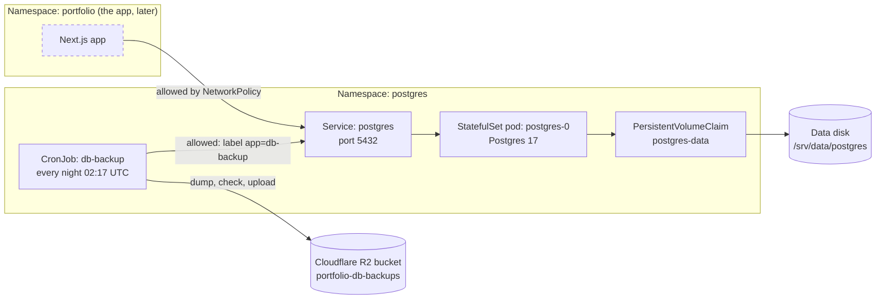
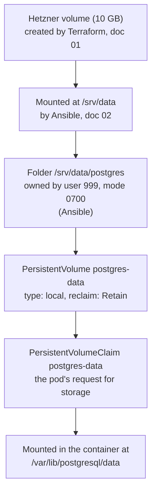
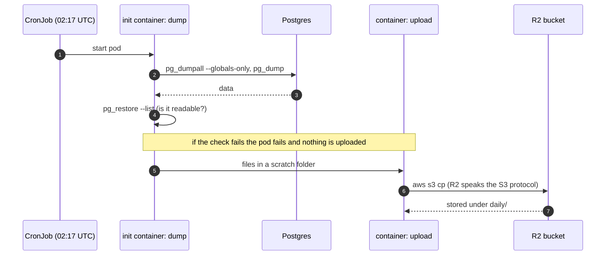

# 06 · PostgreSQL on the data disk, with tested backups

The site needs a database. On AWS it was a managed service (RDS) that cost money every
month. Here we run Postgres ourselves, inside the cluster, on the data disk we already
pay for. Running it yourself means **backups and recovery are your job**, so half of
this doc is about backups, and about proving they work.

**What you will learn:** why databases are different from other apps, how Kubernetes
keeps data safe when a pod dies, how a database is locked down, how backups work, and
how to test a restore.

Read `00-architecture-overview.md` and `05-argocd-gitops.md` first. This is the first
real workload deployed **through ArgoCD**: you merge to git and it appears.

---

## 1. Why a database is different

Most of what we run is **stateless**: if the container dies, start another, nothing is
lost. A database is **stateful**: it holds data that must survive restarts, crashes
and rebuilds. So three questions matter:

1. **Where does the data live**, so it survives the pod?
2. **Who may reach it**, so strangers cannot?
3. **How do we get it back** if something goes wrong?

The rest of the doc answers those three.

## 2. The picture



## 3. Where the data lives: the storage chain

Data must outlive the pod. Here is the chain from the real disk to the container:



| Piece | What it is |
|---|---|
| **PersistentVolume (PV)** | A piece of storage the cluster can hand out. Ours is a `local` volume: a folder on this one machine |
| **PersistentVolumeClaim (PVC)** | A pod's request for storage. It is bound to our PV by name |
| **`Retain`** | If the claim is ever deleted, **keep the data on disk**. Without it, deleting a claim could delete the database |
| **`nodeAffinity`** | A local volume exists on one machine, so the pod must run on that machine |
| **Ownership 999, mode 0700** | Postgres runs as user 999 inside its container and refuses to start if its data folder belongs to someone else or is readable by others |

**Docker comparison:** this is the same idea as `docker run -v /srv/data/postgres:/var/lib/postgresql/data`,
with Kubernetes adding the bookkeeping (a named claim, a retention rule, a placement rule).

**Why a folder owned by 999, set by Ansible?** Kubernetes can fix file ownership for
some kinds of volume, but not for a plain host folder. So the ownership is set once on
the server by Ansible (the `data_volume` role), which keeps it in code like everything
else.

## 4. How the database is run

### 4.1 StatefulSet (and why not an operator)

A **StatefulSet** is the Kubernetes object for apps that keep data. It gives the pod a
stable name (`postgres-0`) and re-attaches the same storage whenever the pod is
replaced. It knows nothing about databases itself.

An **operator** (such as CloudNativePG) is extra software that automates backups,
upgrades and failover. We chose the plain StatefulSet because we have one server (so
failover and replicas do not apply), we want to see every moving part, and memory is
limited. The data is plain Postgres either way, so moving to an operator later wastes
nothing.

### 4.2 The settings that matter

| Setting | Why |
|---|---|
| `image: postgres:17.11-bookworm` | A **pinned** version. Never `latest` for a database: an automatic major upgrade can make the data unreadable |
| `replicas: 1` | One database. Replication is not set up |
| `max_connections=50`, `shared_buffers=128MB` | Small, sensible limits for a 4 GB server shared with other things |
| `requests` / `limits` memory (256 Mi / 512 Mi) | A guaranteed minimum and a hard ceiling, so Postgres cannot starve the node |
| `startupProbe`, `readinessProbe`, `livenessProbe` | Three health checks (below) |
| `terminationGracePeriodSeconds: 60` | Time to shut down cleanly instead of being killed mid-write |

**The three probes**, all running `pg_isready`:

| Probe | Question | If it fails |
|---|---|---|
| **Startup** | "Has first-time setup finished?" | Kubernetes keeps waiting (up to 150 s) before checking anything else |
| **Readiness** | "Can I send you traffic?" | The pod is taken out of the Service until it passes |
| **Liveness** | "Are you alive?" | The pod is **restarted** |

### 4.3 Locking the container down

The namespace enforces Kubernetes' `restricted` pod-security level, so the pod must:
run as a non-root user (999), forbid privilege escalation, drop all Linux capabilities,
and use the default seccomp filter. If any of those is missing, Kubernetes refuses to
create the pod. One setting is left loose on purpose and marked in the file:
`readOnlyRootFilesystem: false`, because the image writes a socket and temp files
outside the data folder. Tightening it is a later improvement.

### 4.4 Two logins, not one

On first start the database runs a script (`postgres-init`) that creates a login called
`portfolio_app` and a database called `portfolio`. The application will use **that**
login, never the all-powerful `postgres` account. If the app is ever compromised, the
attacker gets one database, not the whole server. The script runs **only on an empty
data folder**, the first time. Changing the password in the Secret later does **not**
change it inside the database (see section 10).

### 4.5 Who may connect: NetworkPolicy

By default, any pod in the cluster can try to reach any other. We add two rules:

1. **Deny all incoming connections** to the `postgres` namespace.
2. **Allow** only: the app (from the `portfolio` namespace) and the backup pods (label
   `app=db-backup`), on port 5432 only.

k3s includes the component that enforces these rules, so they are real, not decoration.

## 5. Backups: the design

### 5.1 What we do and what it costs us

Every night at 02:17 UTC a **CronJob** (Kubernetes' version of cron) runs a pod that:

1. dumps the roles and settings (`pg_dumpall --globals-only`),
2. dumps the database (`pg_dump`, "custom" format: compressed, and `pg_restore` can pick pieces),
3. **checks** the dump is a readable archive (`pg_restore --list`) before doing anything else,
4. uploads both files to a **separate** R2 bucket.



Because the checking step runs first, **a broken dump can never replace a good backup.**

### 5.2 Honest limits

- **Up to 24 hours of data can be lost.** If the database is destroyed at 01:00, the
  newest backup is from 02:17 the previous day. This is called the **recovery point
  objective**. For a portfolio this is acceptable; a shop would need more.
- **Restoring means downtime** while you rebuild from the dump (the **recovery time**).
- **No point-in-time recovery.** That needs continuous archiving of the write-ahead log,
  which an operator provides.
- A "logical" backup (`pg_dump`) is a copy of the data as SQL objects, not of the raw
  files. It is portable between Postgres versions and simple to verify, which is why we use it.

### 5.3 Where backups go, and why a separate bucket

A backup in the **same place** as the original is not a backup: one mistake destroys
both. So they go to R2, which is outside the server and outside Hetzner. We use a
**separate bucket with its own access key**, limited to that bucket, so a problem with
backups can never touch the Terraform state in the other bucket (and the reverse).

**Retention** (how long to keep old backups) is handled by an **R2 lifecycle rule**
that deletes objects older than 30 days. It is set in the dashboard (section 7), because
having a backup job *delete* things is a risk: a bug there could remove good backups.

### 5.4 A backup is only real once restored

`infra/k8s/ops/restore-test.yaml` is a one-off Job that downloads the newest backup,
restores it into a scratch database called `restore_test` (never the live one), counts
tables and rows, and drops the scratch database. **Run it after the first backup, and
again from time to time.** It is deliberately not synced by ArgoCD: you run it on demand.

## 6. Secrets: created by hand, never in git

Two Secrets, both in the `postgres` namespace:

| Secret | Keys | Used by |
|---|---|---|
| `postgres-credentials` | `postgres-password`, `app-password` | The database, and the backup job |
| `r2-backup` | `access-key-id`, `secret-access-key`, `endpoint`, `bucket` | The backup upload (and the restore test) |

Generate passwords that are safe to put inside a SQL script (letters and digits only):

```bash
openssl rand -hex 24
```

Store each one in your password manager the moment you create it.

## 7. Step by step (you do these)

### Step A: R2 bucket and key for backups

In the Cloudflare dashboard:

1. **R2 Object Storage**, then **Create bucket**, named `portfolio-db-backups`. Keep it
   private (the default).
2. Open the bucket's **Settings**, then **Object lifecycle rules**, then **Add rule**:
   delete objects older than **30 days**, for the prefix `daily/`.
3. Back on the R2 overview, **Manage API tokens**, then **Create API token**:
   permission **Object Read & Write**, limited to the bucket `portfolio-db-backups`
   **only**. Name it `db-backup`.
4. Copy the **Access Key ID** and the **Secret Access Key** (shown once) into your
   password manager. The endpoint is the same account endpoint you already have:
   `https://<ACCOUNT_ID>.r2.cloudflarestorage.com`.

Do **not** reuse the Terraform state key.

### Step B: create the data folder (Ansible)

The data folder must exist with the right owner **before** the pod starts. From
`infra/ansible`. Root login is off now, so run as your admin user:

```bash
ansible-playbook playbooks/01-bootstrap.yml -u bamise
```

The recap should show `failed=0` with one `changed` (the new folder). Check it:

```bash
ssh -i ~/.ssh/hetzner_portfolio bamise@<server-ip> "sudo ls -ld /srv/data/postgres"
```

You should see `drwx------ ... 999 999 ... /srv/data/postgres`. The two `999`s are the owner.

### Step C: merge, and let ArgoCD deploy

After the pull request is merged to `develop`, ArgoCD creates the namespace, storage,
config, service, database and backup job within a few minutes:

```bash
kubectl -n argocd get applications          # postgres appears
kubectl -n postgres get pods
```

**Expect the database pod to be stuck at first.** It will show
`CreateContainerConfigError`, because the Secret it needs does not exist yet. That is
correct and temporary: the next step fixes it, and the pod then starts by itself.

### Step D: create the secrets

```bash
read -rsp "Postgres superuser password: " PGPW; echo
read -rsp "App password: " APPPW; echo
kubectl -n postgres create secret generic postgres-credentials \
  --from-literal=postgres-password="$PGPW" --from-literal=app-password="$APPPW"
unset PGPW APPPW

read -rsp "R2 access key ID: " R2ID; echo
read -rsp "R2 secret access key: " R2SECRET; echo
read -rp "R2 endpoint (https://<account>.r2.cloudflarestorage.com): " R2EP
kubectl -n postgres create secret generic r2-backup \
  --from-literal=access-key-id="$R2ID" --from-literal=secret-access-key="$R2SECRET" \
  --from-literal=endpoint="$R2EP" --from-literal=bucket=portfolio-db-backups
unset R2ID R2SECRET R2EP
```

(`$PGPW` and the others are variables, so your shell history keeps the names, not the
values.)

**Alternative for the R2 backup key: use the macOS Keychain.** Store the two values once
(each command prompts you and hides what you type), using **new names** so the backup key
never mixes with the Terraform state key (`portfolio-r2-key-id` and `portfolio-r2-secret`):

```bash
security add-generic-password -U -a "$USER" -s portfolio-r2-backup-key-id -w
security add-generic-password -U -a "$USER" -s portfolio-r2-backup-secret -w
```

Check they are stored without showing them:

```bash
security find-generic-password -a "$USER" -s portfolio-r2-backup-key-id >/dev/null && echo "key id: stored"
security find-generic-password -a "$USER" -s portfolio-r2-backup-secret >/dev/null && echo "secret: stored"
```

Then create the Secret straight from the Keychain, with no pasting (replace the account
ID, which is not a secret and is in `backend.hcl`):

```bash
kubectl -n postgres create secret generic r2-backup \
  --from-literal=access-key-id="$(security find-generic-password -a "$USER" -s portfolio-r2-backup-key-id -w)" \
  --from-literal=secret-access-key="$(security find-generic-password -a "$USER" -s portfolio-r2-backup-secret -w)" \
  --from-literal=endpoint="https://<your-account-id>.r2.cloudflarestorage.com" \
  --from-literal=bucket=portfolio-db-backups
```

Keep your **password manager** as the permanent copy; the Keychain is the convenient one
on this Mac. The Keychain is **not linked to the cluster**: if you rotate the R2 key later,
update the Keychain item, then delete and re-create the Kubernetes Secret
(`kubectl -n postgres delete secret r2-backup`, then create it again).

Then watch the pod start:

```bash
kubectl -n postgres get pods -w
```

First start takes up to a minute while the database initialises. Wait for
`postgres-0   1/1   Running`.

### Step E: check the database

```bash
kubectl -n postgres exec postgres-0 -- psql -U postgres -c '\l'
```

You should see the databases `portfolio` (owner `portfolio_app`), `postgres`,
`template0` and `template1`. Then check the app login works and make a test table, so
there is something to back up (you will be asked for the **app** password):

```bash
kubectl -n postgres exec -it postgres-0 -- psql -h 127.0.0.1 -U portfolio_app -d portfolio \
  -c "CREATE TABLE IF NOT EXISTS smoke_test (id serial PRIMARY KEY, note text);" \
  -c "INSERT INTO smoke_test (note) VALUES ('hello from the first backup test');" \
  -c "SELECT * FROM smoke_test;"
```

### Step F: run the first backup by hand

Do not wait for 02:17:

```bash
kubectl -n postgres create job --from=cronjob/db-backup db-backup-manual-1
kubectl -n postgres get pods -w        # wait for db-backup-manual-1-... to show Completed
kubectl -n postgres logs job/db-backup-manual-1 -c dump
kubectl -n postgres logs job/db-backup-manual-1 -c upload
```

The `dump` log should end with a listing of two files (`globals-...sql` and
`portfolio-...dump`). The `upload` log shows two `upload:` lines. Confirm in the
Cloudflare dashboard: the bucket should now contain `daily/globals-...` and
`daily/portfolio-...`. Clean up: `kubectl -n postgres delete job db-backup-manual-1`.

### Step G: the restore test (the important one)

```bash
kubectl apply -f infra/k8s/ops/restore-test.yaml
kubectl -n postgres logs -f job/restore-test -c restore
```

You should see the name of the file it restored from, then a table count and
`smoke_test: ~1 rows`, then **`RESTORE TEST PASSED`**. (A row estimate can show `~0`
right after a restore, before the statistics update; the table existing is what matters.)
Then clean up: `kubectl -n postgres delete job restore-test`.

### Step H: prove the data survives a crash

```bash
kubectl -n postgres delete pod postgres-0
kubectl -n postgres get pods -w
```

Kubernetes starts a new `postgres-0` and re-attaches the same storage. When it is
`Running` again, check the row is still there:

```bash
kubectl -n postgres exec -it postgres-0 -- psql -h 127.0.0.1 -U portfolio_app -d portfolio -c "SELECT * FROM smoke_test;"
```

### Step I: prove strangers are blocked

From a pod in a **different** namespace, try to reach the database. It should **time out**:

```bash
kubectl run nettest --rm -it --restart=Never --image=postgres:17.11-bookworm -- \
  pg_isready -h postgres.postgres.svc.cluster.local -t 5
```

Expect `no response`. (From the `postgres` namespace's backup pods it works; from
`default` it does not. That is the NetworkPolicy doing its job.)

## 8. Reading the output

| What you see | Meaning |
|---|---|
| `pg_isready`: `accepting connections` (exit 0) | The database is up |
| `pg_isready`: `rejecting connections` (exit 1) | Starting up or shutting down |
| `pg_isready`: `no response` (exit 2) | Nothing answered: pod down, wrong address, or blocked by the NetworkPolicy |
| `pg_isready`: `no attempt` (exit 3) | A mistake in the command (bad parameters) |
| Pod `CreateContainerConfigError` | A Secret the pod needs does not exist (expected before step D) |
| Pod `Init:0/1`, `Init:Error` | The init container (the dump step) is running or failed: `kubectl logs <pod> -c dump` |
| Pod `Completed` (a Job) | It finished successfully |
| CronJob `LAST SCHEDULE` | When it last started; `ACTIVE 0` means none is running now |
| `FATAL: password authentication failed` | Wrong password for that login |
| `FATAL: database "x" does not exist` | The init script did not run, or a typo |
| `psql: connection refused` | Not listening yet, or wrong host or port |
| `could not translate host name` | DNS: wrong service name or namespace |

## 9. When things go wrong

| Symptom | Likely cause and fix |
|---|---|
| Pod stays `Pending` | `kubectl -n postgres describe pod postgres-0`. Often the claim is not bound: `kubectl get pv,pvc -A` should show `Bound`. A name or node mismatch in `10-storage.yaml` breaks it |
| `FATAL: data directory ... has wrong ownership` or `has invalid permissions` | The folder is not owned by 999 or not mode 0700: re-run step B and check with `ls -ld` |
| `initdb: error: directory exists but is not empty` | Something is already inside `/srv/data/postgres`. Inspect it before deleting anything |
| App login or database missing | The init script only runs on an **empty** data folder. If the folder had data, it was skipped (see section 10 to fix by hand) |
| Pod `OOMKilled` | Hit the 512 Mi ceiling: look at `kubectl top pods -n postgres`; lower `shared_buffers` or raise the limit |
| Backup or restore pod fails at once with `Connection refused` to `postgres:5432` | **The new-pod gap** (see "A problem we hit" below). The jobs now wait for the database; if you still see it, check the `app=db-backup` label |
| Backup pod `Init:Error` | The dump failed: read `kubectl logs ... -c dump`. `connection timed out` usually means the pod lacks the `app=db-backup` label; `password authentication failed` means the Secret differs from the real password |
| Backup `upload` fails with `AccessDenied` / `403` | The R2 key lacks Object Read & Write on **this** bucket, or the endpoint is wrong |
| Upload fails with a checksum or `Content-MD5` error | The two `AWS_*_CHECKSUM` settings in the job (they are there for this reason) |
| `ImagePullBackOff` | The image tag is wrong, or the server cannot reach Docker Hub |
| ArgoCD `postgres` app `OutOfSync` or `Sync failed` | `kubectl -n argocd describe application postgres`. A `not permitted` message means the `portfolio` project does not allow it: check `00-project.yaml` |
| Restore test fails at `pg_restore` | Read the error above `RESTORE TEST PASSED`'s absence; an empty or corrupt dump is exactly what this test exists to catch |

### A problem we hit: "Connection refused" from the backup pod

The first manual backup failed three times in a row with
`pg_dumpall: connection to server at "postgres" ... port 5432 failed: Connection refused`,
even though the database was healthy. This is a good example of narrowing a problem
down, so here is how it went:

| What we checked | Result | What it ruled out |
|---|---|---|
| Is Postgres running and ready? | Yes: `1/1 Running`, no restarts | The database itself |
| Is it listening on the network? | `listen_addresses = *` | A "localhost only" setting |
| Does the Service point at the right pod? | Yes, same IP (`10.42.0.25`) | A DNS or Service mistake |
| Do the backup pods have the label `app=db-backup`? | Yes | A missing label |
| Test from a labelled pod **with a temporary allow-everything policy** | `accepting connections` | Proved the **network policy** was the blocker |
| Test with only a label rule | Blocked | The rule text was not the problem |
| Test with an **address-based** rule (`ipBlock`) | `accepting connections` | The policy engine works |
| Test from a pod that had been **running for a few seconds**, real policies | `accepting connections` | The rule is right; **brand-new pods are blocked at first** |

**The cause:** the network layer takes a second or two to learn about a **new pod** and
its labels. During that moment its connections are refused. The backup pod's first action
is to connect, immediately, so it fell into the gap, and its automatic retries (each a
new pod) did the same.

**The fix:** the backup and restore jobs now **wait until the database is reachable**
(`pg_isready` in a loop, up to two minutes) before doing anything. That also makes them
robust whenever Postgres is briefly restarting.

**Lessons:**
- A refusal (`Connection refused`) from a pod to a pod is often a **network policy**, not a
  stopped service. A quick test is to add a temporary allow-everything policy: if it works
  then, the policy is the cause. **Delete the temporary policy straight away.**
- Test with a long-lived pod, not only a short-lived one, to separate "rule is wrong"
  from "rule is not yet in effect".
- Anything that connects to a locked-down service at start-up should **retry**.

## 10. Things to know

- **Changing the password later:** editing the Secret does not change the login inside
  the database. To change the app password, also run
  `ALTER ROLE portfolio_app PASSWORD '...';` via `psql`, and update the Secret.
- **Upgrading Postgres:** never just change the image tag to a new **major** version
  (17 to 18): the data files are not compatible. The safe way is dump, start a new
  empty database on the new version, restore. Minor versions (17.11 to 17.12) are safe.
- **Deleting things:** the PersistentVolume and claim are marked `Prune=false` (ArgoCD
  never deletes them), the volume is `Retain`, and the ArgoCD application has no
  delete-cascade. Together they stop an accidental `git` change from deleting the data.
- **Disk space:** the volume is 10 GB. Check with `df -h /srv/data` on the server.
  A volume can be enlarged later, but never shrunk.

## 11. Security notes

- The database runs as **non-root**, with **no extra privileges**, under the
  `restricted` pod-security level.
- **Only the app and the backup pods** may connect (NetworkPolicy).
- The app uses a **dedicated login** with access to one database, not the superuser.
- **Secrets are never in git.** They are created by hand; ArgoCD does not manage or
  delete them (it only touches what is in git).
- **The backups contain all your data.** The bucket is private, its key is limited to
  that one bucket, and R2 encrypts data at rest.
- Rotate the R2 key and database passwords if you are ever unsure who has seen them.

## 12. Cost

- Postgres uses part of the existing server: roughly 256 to 512 MB of memory.
- R2 storage for nightly dumps of a small database is a few megabytes a day, well inside
  the free tier, and R2 has no charge for downloads.
- Nothing new is billed by Hetzner.

## 13. What comes next

`07` The application itself: build the image, push it to a registry, deploy it with
ArgoCD, and connect it to this database. Then monitoring, and the cut-over of the real
domain.
