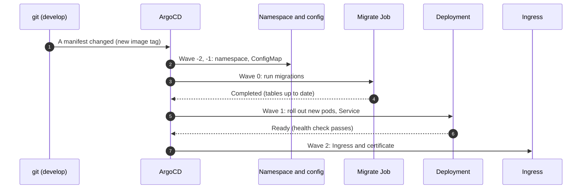
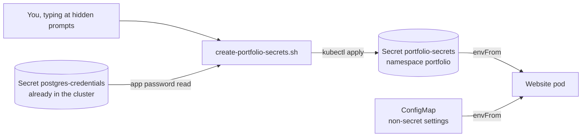

# 07 · The application: from a commit to a running website

Docs 01 to 06 built the platform: server, Kubernetes, HTTPS, GitOps, database. This
doc puts the website itself on it.

**What you will learn:** how a code change becomes a container image, how that image
reaches the cluster, how the database tables get created, where secrets live, and how
to read each manifest file.

> **Status: written, not yet verified.** Following our rule, nothing here is called
> "working" until we have seen it work. The verified results go in section 9 after the
> first deploy.

---

## 1. The big picture


Two separate things happen, and it helps to keep them apart:

| Step | Who | What it produces |
|---|---|---|
| **Build** | GitHub Actions | Two container images in the registry, tagged with the commit |
| **Deploy** | ArgoCD | The cluster running the version named in git |

Building does **not** deploy. To release a version you change the image tag in
`infra/k8s/apps/portfolio/` in a pull request. That makes every release a reviewed,
reversible git change (a rollback is a revert).

## 2. The two images

| Image | Built from Dockerfile target | Job |
|---|---|---|
| `cloudportfoliowebsite` | `runner` | The Next.js website. Runs as user `nextjs` (1001) |
| `cloudportfoliowebsite-migrator` | `migrator` | Runs `prisma migrate deploy` once, then exits. Runs as user `node` (1000) |

**Why two?** The website image is deliberately small and contains no database tooling.
The migrator carries the tools needed to change the database, but only runs briefly.
Keeping them apart means the always-on, internet-facing container has less in it.

**Tags.** An image is named `ghcr.io/<owner>/<name>:sha-<first 7 characters of the
commit>`. A tag like this never changes meaning, so the cluster always runs exactly
what you reviewed. `latest` is avoided because nobody can tell which version it is.

**`NEXT_PUBLIC_*` values** (site URL, reCAPTCHA *site* key, analytics ID) are baked
into the browser code when the image is built, because browsers cannot read the
cluster's settings. They are public by design, so they are GitHub repository
*variables*, not secrets. Changing one means building a new image.

## 3. What happens on a release, step by step



**Sync waves** are numbers on the manifests (`argocd.argoproj.io/sync-wave`). ArgoCD
applies lower numbers first and waits for each wave to be healthy before the next.
That guarantees the database is migrated **before** the new website version starts.

## 4. The files, explained

All in `infra/k8s/apps/portfolio/`. Numbers are just reading order.

| File | What it is | Key idea |
|---|---|---|
| `00-namespace.yaml` | A folder for the website | Label `pod-security...: restricted` makes Kubernetes reject any pod that runs as root |
| `10-configmap.yaml` | Non-secret settings | `HOSTNAME: 0.0.0.0` lets the Service reach the app inside the pod |
| `20-migrate-job.yaml` | Creates/updates tables | An ArgoCD **hook**; `backoffLimit: 6` retries, because a brand-new pod can be blocked from the database for a second or two by the network policy (doc 06) |
| `30-deployment.yaml` | Keeps the website running | See below |
| `40-service.yaml` | Stable internal address | Port 80 forwards to the container's 3000 |
| `50-ingress.yaml` | Hostname to Service, plus the HTTPS certificate | The `cert-manager.io/cluster-issuer` annotation requests the certificate (doc 04) |
| `60-networkpolicy.yaml` | Who may connect | Deny everything, then allow only Traefik, on port 3000 |

### Reading the Deployment

| Line | Meaning |
|---|---|
| `replicas: 1` | One copy. A second would only use more of the 4 GB |
| `maxUnavailable: 0`, `maxSurge: 1` | During an update, start the new copy first, and only remove the old one once the new one is ready: no downtime |
| `runAsNonRoot`, `runAsUser: 1001` | Never root |
| `allowPrivilegeEscalation: false`, `capabilities: drop: [ALL]` | The process cannot gain extra powers |
| `readOnlyRootFilesystem: true` | The app cannot modify its own files, so an attacker cannot plant code |
| `emptyDir` at `/tmp` and `/app/.next/cache` | The only writable spots: throwaway folders that vanish with the pod |
| `envFrom` | Loads every key of the ConfigMap and the Secret as environment variables |
| `livenessProbe` | "Is it alive?" If it keeps failing, Kubernetes restarts the pod |
| `readinessProbe` | "Ready for visitors?" No traffic arrives until it passes |
| `requests` / `limits` | The memory it is promised / the most it may use (512 MiB). A leak is stopped here instead of starving the whole server |

> **A limit of the health check:** `/api/health` only proves the web process answers.
> It does not check the database. That is fine for "restart if dead"; it would be wrong
> for "stop sending traffic if the database is down", which is why it is not used that
> way.

## 5. Secrets: where they live and how they get there



The repository is public, so no secret value may ever be in git. The Secret is created
by hand, once, with `infra/scripts/create-portfolio-secrets.sh`.

| Key in the Secret | What it is | Where it comes from |
|---|---|---|
| `DATABASE_URL` | Address and password of the database | Built from the existing database Secret (you are not asked again) |
| `JWT_SECRET` | Signs admin login sessions | Generated randomly by the script |
| `ADMIN_EMAIL`, `ADMIN_PASSWORD` | The admin login for `/admin` | You choose |
| `RESEND_API_KEY`, `RESEND_FROM_EMAIL` | Sending email (contact form, newsletter) | Your Resend account |
| `CONTACT_EMAIL` | Where contact messages go | You |
| `REDIS_URL` | Rate limiting store | Your Redis Cloud account |
| `RECAPTCHA_SECRET_KEY` | Verifies the contact form is used by a human | Google reCAPTCHA (the *secret* key, not the site key) |

### Reading the script's bash

| Line | What it does |
|---|---|
| `set -euo pipefail` | Stop at the first error, treat unset variables as errors, and fail a pipeline if any part fails |
| `kubectl config current-context` check | Refuses to run against the wrong cluster |
| `base64 -d` | Kubernetes stores Secret values base64-encoded (an encoding, not encryption); this decodes the stored password |
| `urllib.parse.quote` | A password with `@` or `/` would break the connection address; this escapes it |
| `openssl rand -base64 48` | 48 random bytes, so a 64-character key |
| `read -rs -p` | `-s` hides typing, `-r` keeps backslashes literal. Nothing goes to shell history |
| `mktemp`, `chmod 600`, `trap 'rm -f' EXIT` | A private temporary file that is always deleted, even on error |
| `--dry-run=client -o yaml \| kubectl apply -f -` | Create **or** update: safe to run again |

**Honest limits.** A Kubernetes Secret is only as private as access to the cluster. We
turned on encryption of Secrets at rest (doc 03). A later improvement is Sealed
Secrets or SOPS, so secrets can live encrypted in git (see the TODO list).

## 6. Run it (you do these)

1. **Merge the pull request** that adds these files. ArgoCD notices and starts syncing.
   It will wait on the missing Secret; that is expected.
2. **Create the secrets** (from the repo root):

   ```bash
   export KUBECONFIG=~/.kube/hetzner-portfolio.yaml
   kubectl config current-context        # must print: hetzner-portfolio
   bash infra/scripts/create-portfolio-secrets.sh
   ```

3. **Watch it come up:**

   ```bash
   kubectl -n portfolio get pods -w      # the migrate pod Completes, then the website goes 1/1 Running
   kubectl -n portfolio get certificate  # READY True once HTTPS is issued (about a minute)
   ```

4. Open `https://test.oluwabamiseomolaso.com.ng`.

> The old `hello` test page used the same hostname, so it is removed in the same change.
> Two Ingresses cannot share one hostname.

## 7. Known limit: the visitor's IP address

Behind Cloudflare, Traefik and the built-in load balancer, the app sees the cluster's
internal address (`10.42.0.1`) instead of the visitor's. The app's rate limiting counts
requests per address, so right now every visitor looks like the same one. This is a
separate, planned change (trust Cloudflare's `CF-Connecting-IP` header and only accept
traffic from Cloudflare). It **must** be done before the real domain is switched over.

## 8. When things go wrong

| Symptom | Likely cause |
|---|---|
| Pods `CreateContainerConfigError` | `portfolio-secrets` does not exist yet: run the script |
| Migrate Job fails repeatedly | Wrong `DATABASE_URL`, or the database is down: `kubectl -n portfolio logs job/portfolio-migrate` |
| `ImagePullBackOff` | The image tag does not exist, or the package is not public |
| Website pod `CrashLoopBackOff` | `kubectl -n portfolio logs deploy/portfolio`: usually a missing or short `JWT_SECRET` (needs 32+ characters) |
| `OOMKilled` | Hit the 512 MiB limit: check `kubectl top pods -A` |
| Certificate stays `False` | `kubectl -n portfolio describe certificate portfolio-tls` and see doc 04 |
| ArgoCD shows `OutOfSync` for the Namespace | Harmless: the script created it first; sync once |

## 9. Verified results

*To be filled in after the first deploy.*
