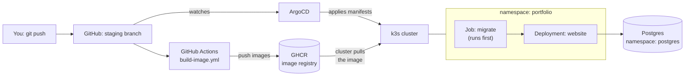
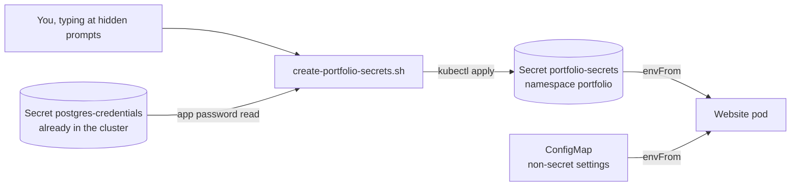
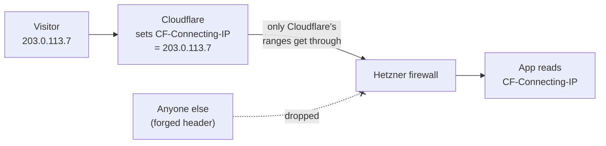

# 07 · The application: from a commit to a running website

Docs 01 to 06 built the platform: server, Kubernetes, HTTPS, GitOps, database. This
doc puts the website itself on it.

**What you will learn:** how a code change becomes a container image, how that image
reaches the cluster, how the database tables get created, where secrets live, and how
to read each manifest file.

> **Status: verified** on `test.oluwabamiseomolaso.com.ng` (section 9). The real domain
> is not switched over yet, and the visitor-IP limit in section 7 is still open.

---

## 1. The big picture



Two separate things happen, and it helps to keep them apart:

| Step | Who | What it produces |
|---|---|---|
| **Build** | GitHub Actions | Two container images in the registry, tagged with the commit |
| **Deploy** | ArgoCD | The cluster running the version named in git |

Building does **not** deploy. To release a version you change the image tag in
`infra/k8s/apps/portfolio/` in a pull request. That makes every release a reviewed,
reversible git change (a rollback is a revert).

## 2. The two images

| Image | Built from Dockerfile target | Job |
|---|---|---|
| `cloudportfoliowebsite` | `runner` | The Next.js website. Runs as user `nextjs` (1001) |
| `cloudportfoliowebsite-migrator` | `migrator` | Runs `prisma migrate deploy` once, then exits. Runs as user `node` (1000) |

**Why two?** The website image is deliberately small and contains no database tooling.
The migrator carries the tools needed to change the database, but only runs briefly.
Keeping them apart means the always-on, internet-facing container has less in it.

**Tags.** An image is named `ghcr.io/<owner>/<name>:sha-<first 7 characters of the
commit>`. A tag like this never changes meaning, so the cluster always runs exactly
what you reviewed. `latest` is avoided because nobody can tell which version it is.

**`NEXT_PUBLIC_*` values** (site URL, reCAPTCHA *site* key, analytics ID) are baked
into the browser code when the image is built, because browsers cannot read the
cluster's settings. They are public by design, so they are GitHub repository
*variables*, not secrets. Changing one means building a new image.

## 3. What happens on a release, step by step


**Sync waves** are numbers on the manifests (`argocd.argoproj.io/sync-wave`). ArgoCD
applies lower numbers first and waits for each wave to be healthy before the next.
That guarantees the database is migrated **before** the new website version starts.

## 4. The files, explained

All in `infra/k8s/apps/portfolio/`. Numbers are just reading order.

| File | What it is | Key idea |
|---|---|---|
| `00-namespace.yaml` | A folder for the website | Label `pod-security...: restricted` makes Kubernetes reject any pod that runs as root |
| `10-configmap.yaml` | Non-secret settings | `HOSTNAME: 0.0.0.0` lets the Service reach the app inside the pod |
| `20-migrate-job.yaml` | Creates/updates tables | An ArgoCD **hook**; `backoffLimit: 6` retries, because a brand-new pod can be blocked from the database for a second or two by the network policy (doc 06) |
| `30-deployment.yaml` | Keeps the website running | See below |
| `40-service.yaml` | Stable internal address | Port 80 forwards to the container's 3000 |
| `50-ingress.yaml` | Hostname to Service, plus the HTTPS certificate | The `cert-manager.io/cluster-issuer` annotation requests the certificate (doc 04) |
| `60-networkpolicy.yaml` | Who may connect | Deny everything, then allow only Traefik, on port 3000 |

### Reading the Deployment

| Line | Meaning |
|---|---|
| `replicas: 1` | One copy. A second would only use more of the 4 GB |
| `maxUnavailable: 0`, `maxSurge: 1` | During an update, start the new copy first, and only remove the old one once the new one is ready: no downtime |
| `runAsNonRoot`, `runAsUser: 1001` | Never root |
| `allowPrivilegeEscalation: false`, `capabilities: drop: [ALL]` | The process cannot gain extra powers |
| `readOnlyRootFilesystem: true` | The app cannot modify its own files, so an attacker cannot plant code |
| `emptyDir` at `/tmp` and `/app/.next/cache` | The only writable spots: throwaway folders that vanish with the pod |
| `envFrom` | Loads every key of the ConfigMap and the Secret as environment variables |
| `livenessProbe` | "Is it alive?" If it keeps failing, Kubernetes restarts the pod |
| `readinessProbe` | "Ready for visitors?" No traffic arrives until it passes |
| `requests` / `limits` | The memory it is promised / the most it may use (512 MiB). A leak is stopped here instead of starving the whole server |

> **A limit of the health check:** `/api/health` only proves the web process answers.
> It does not check the database. That is fine for "restart if dead"; it would be wrong
> for "stop sending traffic if the database is down", which is why it is not used that
> way.

## 5. Secrets: where they live and how they get there



The repository is public, so no secret value may ever be in git. The Secret is created
by hand, once, with `infra/scripts/create-portfolio-secrets.sh`.

| Key in the Secret | What it is | Where it comes from |
|---|---|---|
| `DATABASE_URL` | Address and password of the database | Built from the existing database Secret (you are not asked again) |
| `JWT_SECRET` | Signs admin login sessions | Generated randomly by the script |
| `ADMIN_EMAIL`, `ADMIN_PASSWORD` | The admin login for `/admin` | You choose |
| `RESEND_API_KEY`, `RESEND_FROM_EMAIL` | Sending email (contact form, newsletter) | Your Resend account |
| `CONTACT_EMAIL` | Where contact messages go | You |
| `REDIS_URL` | Rate limiting store | Your Redis Cloud account |
| `RECAPTCHA_SECRET_KEY` | Verifies the contact form is used by a human | Google reCAPTCHA (the *secret* key, not the site key) |

### Reading the script's bash

| Line | What it does |
|---|---|
| `set -euo pipefail` | Stop at the first error, treat unset variables as errors, and fail a pipeline if any part fails |
| `kubectl config current-context` check | Refuses to run against the wrong cluster |
| `base64 -d` | Kubernetes stores Secret values base64-encoded (an encoding, not encryption); this decodes the stored password |
| `urllib.parse.quote` | A password with `@` or `/` would break the connection address; this escapes it |
| `openssl rand -base64 48` | 48 random bytes, so a 64-character key |
| `read -rs -p` | `-s` hides typing, `-r` keeps backslashes literal. Nothing goes to shell history |
| `mktemp`, `chmod 600`, `trap 'rm -f' EXIT` | A private temporary file that is always deleted, even on error |
| `--dry-run=client -o yaml \| kubectl apply -f -` | Create **or** update: safe to run again |

**Honest limits.** A Kubernetes Secret is only as private as access to the cluster. We
turned on encryption of Secrets at rest (doc 03). A later improvement is Sealed
Secrets or SOPS, so secrets can live encrypted in git (see the TODO list).

## 6. Run it (you do these)

1. **Merge the pull request** that adds these files. ArgoCD notices and starts syncing.
   It will wait on the missing Secret; that is expected.
2. **Create the secrets** (from the repo root):

   ```bash
   export KUBECONFIG=~/.kube/hetzner-portfolio.yaml
   kubectl config current-context        # must print: hetzner-portfolio
   bash infra/scripts/create-portfolio-secrets.sh
   ```

3. **Watch it come up:**

   ```bash
   kubectl -n portfolio get pods -w      # the migrate pod Completes, then the website goes 1/1 Running
   kubectl -n portfolio get certificate  # READY True once HTTPS is issued (about a minute)
   ```

4. Open `https://test.oluwabamiseomolaso.com.ng`.

> The old `hello` test page used the same hostname, so it is removed in the same change.
> Two Ingresses cannot share one hostname.

## 7. The visitor's IP address

**The problem.** Behind Cloudflare, Traefik and the built-in load balancer, the app saw
the cluster's internal address (`10.42.0.1`) for every visitor. The app's rate limiting
counts requests per address, so all visitors shared one allowance, and audit logs
recorded a proxy chain instead of a person.

**The fix has two halves that only work together:**



| Half | Where | What it does |
|---|---|---|
| App | `src/lib/client-ip.ts` | One helper, used by the rate limiter and every audit log. It reads `CF-Connecting-IP` first. Cloudflare overwrites this header, so a visitor cannot forge it *through* Cloudflare |
| Firewall | `modules/firewall`, prod env | Ports 80 and 443 accept only Cloudflare's published ranges, so a visitor cannot skip Cloudflare and send the header themselves |

**Why not `X-Forwarded-For`?** Cloudflare *appends* the real address to that header, so
a visitor can put a fake one first (`1.2.3.4, <real>`). Taking the first entry would let
anyone pick their own rate-limit bucket. It is kept only as a fallback for running the
app without Cloudflare (local development).

**Consequences to remember**
- Every DNS record that points at this server must be **proxied** (orange cloud).
  A DNS-only (grey cloud) record would now be unreachable.
- Cloudflare's address list is read when you run `terraform plan/apply`. If Cloudflare
  adds a range, the next plan shows it. Run a plan occasionally.
- Visiting the server's IP address directly no longer works. That is intended.

> **Status: verified** (section 9).

## 8. When things go wrong

| Symptom | Likely cause |
|---|---|
| Pods `CreateContainerConfigError` | `portfolio-secrets` does not exist yet: run the script |
| Migrate Job fails repeatedly | Wrong `DATABASE_URL`, or the database is down: `kubectl -n portfolio logs job/portfolio-migrate` |
| `ImagePullBackOff` | The image tag does not exist, or the package is not public |
| Website pod `CrashLoopBackOff` | `kubectl -n portfolio logs deploy/portfolio`: usually a missing or short `JWT_SECRET` (needs 32+ characters) |
| `OOMKilled` | Hit the 512 MiB limit: check `kubectl top pods -A` |
| Certificate stays `False` | `kubectl -n portfolio describe certificate portfolio-tls` and see doc 04 |
| ArgoCD shows `OutOfSync` for the Namespace | Harmless: the script created it first; sync once |
| Migrate Job fails with `P3005 The database schema is not empty` | The database already has tables Prisma did not create (we hit this: the doc 06 `smoke_test` table). Drop the leftovers, or "baseline" a real existing database |
| Sync hangs on `waiting for completion of hook batch/Job/portfolio-migrate` | A hook Job was deleted by hand mid-sync and is stuck `Terminating` on ArgoCD's finalizer. Remove it: `kubectl -n portfolio patch job portfolio-migrate --type merge -p '{"metadata":{"finalizers":null}}'`, then clear the stale operation: `kubectl -n argocd patch application portfolio --type merge -p '{"operation":null}'`. Better habit: never delete a hook Job by hand; fix the cause and let ArgoCD re-run it |

## 9. Verified results

Seen working on 2 October 2026:

| Check | Result |
|---|---|
| Migration Job | `Completed` in 7 seconds; **15 tables** created in the `portfolio` database |
| Website pod | `1/1 Running`, ready in about 130 ms; uses about 40 MiB of memory |
| ArgoCD | `portfolio`, `postgres`, `root` all `Synced` and `Healthy` |
| HTTPS certificate | `portfolio-tls` `READY True` about a minute after the sync (Let's Encrypt, via Cloudflare DNS-01) |
| Live site | `/` , `/blog`, `/admin` and `/api/health` all answer HTTP 200 over HTTPS |
| Node memory | about 66 percent of 4 GB with ArgoCD, Postgres and the site running |

### What went wrong the first time (and why it is worth reading)

1. **The migration failed with `P3005`.** The database was not empty: it still held the
   `smoke_test` table from the backup test in doc 06. Prisma refuses to run migrations
   against a database it did not set up, because it cannot know what is in there. We
   dropped the test table (it held one test row) and the migration then succeeded.
   Lesson: a database meant for the app should hold nothing else.
2. **The sync then hung.** We had deleted the failed Job by hand while ArgoCD was
   waiting on it. ArgoCD puts a finalizer on hook Jobs and kept waiting for a Job that
   could not finish deleting. Clearing the finalizer and the stale operation fixed it
   (commands in section 8).
3. **`kubectl` timed out** before any of this: our home IP had changed again. This is the
   known limit of the allow-list; see `runbooks/01-my-ip-changed.md` and the WireGuard
   plan in the TODO list.

### The visitor IP fix (3 October 2026)

| Check | Result |
|---|---|
| Terraform plan | `0 to add, 1 to change, 0 to destroy`: only the HTTP and HTTPS rules changed, to 22 Cloudflare ranges (15 IPv4, 7 IPv6). SSH and the Kubernetes API rules were not in the plan |
| Site through the domain | `/`, `/blog`, `/api/health` all HTTP 200 after the apply |
| Server reached directly by IP | HTTPS and HTTP both **time out** (curl exit 28) |
| SSH and `kubectl` | Still work (admin rules untouched) |
| Real visitor address recorded | An invalid newsletter signup writes a row to `failed_attempts`. The row held the public IP of the machine that sent the request (it matched `curl -4 https://ifconfig.me`), not the cluster address `10.42.0.1`. The test row was deleted afterwards |

**How to repeat the last check:** send one request with an invalid email to
`/api/newsletter/subscribe`, read the newest `failed_attempts` row, compare its
`ip_address` to `curl -4 https://ifconfig.me`, then delete the row. (Do not paste your
own address into the docs: this repository is public.)

### End-to-end tests on the test site (3 October 2026)

Testing the real site by hand found three problems the automated tests had not.

| Test | Result |
|---|---|
| Contact form email | Arrives |
| Newsletter signup email | Arrives |
| Rate limit on the contact form (limit: 5 per hour) | **Never blocked.** 15 real submissions and then 8 more test requests all went through |
| Signing up the same email again | **Sent a new welcome email every time**, and quietly replaced the person's unsubscribe links |
| Contact form on the home page | There was none: the section only offered a copy-email button and social links |

**Bug 1: the rate limiter never blocked (found by testing the live site).**
The limiter keeps its counts in Redis. After each request it asked Redis how many
recent requests this visitor had made, and read the answer as `results[1]?.[1]`. That is
how a *different* Redis library (`ioredis`) formats its answer, as `[error, value]`
pairs. This app uses the `redis` package, which returns the plain values:
`[removed, count, added, expire]`. So `results[1]` was a number, `number[1]` is
`undefined`, and the count was always 0: every visitor was always "under the limit".
The unit tests had been written with the same wrong format, so they passed.
*Fix:* read `results[1]` directly, change the tests to the real format. *How to know
the test is honest:* the over-limit test fails against the old code.

**Bug 2: repeat newsletter signups.** The route always did an "upsert" and then sent
emails. For an email already on the list that meant another welcome email, another
notification to you, a counter bump, and, worst, **new tokens**, which invalidated the
unsubscribe and preferences links in the email the person had already received. With
bug 1 as well, anyone could flood a stranger's inbox through the form. *Fix:* look the
email up first. If it is active, return the same success reply as a new signup (so the
form cannot be used to find out who is subscribed) and do nothing else. People who
unsubscribed before can still re-subscribe.

**Bug 3 (a design gap): no visible contact form.** The redesigned home page offered only
"Copy email". We added a **Send a message** button to the existing `/contact` page.

**Verified after the fix:** 7 of 8 rapid contact requests were answered `429 Too Many
Requests` with `retry-after: 3600` (the eighth line printed nothing, a display hiccup in
the test script). Before the fix none were blocked.

**Lessons**
1. *A mock that copies your own wrong assumption proves nothing.* The tests passed
   because they mocked the shape the code expected, not the shape the library returns.
   When you mock a library, take the shape from its documentation or a real response.
2. *Test the behaviour, not just the wiring.* "Send 8 requests, expect some to be
   blocked" found in a minute what the unit tests missed.
3. *Blocked requests still count.* The limiter records every attempt, including
   rejected ones, so hammering the form keeps you blocked longer. After testing it you
   may be locked out of your own form for up to an hour.

