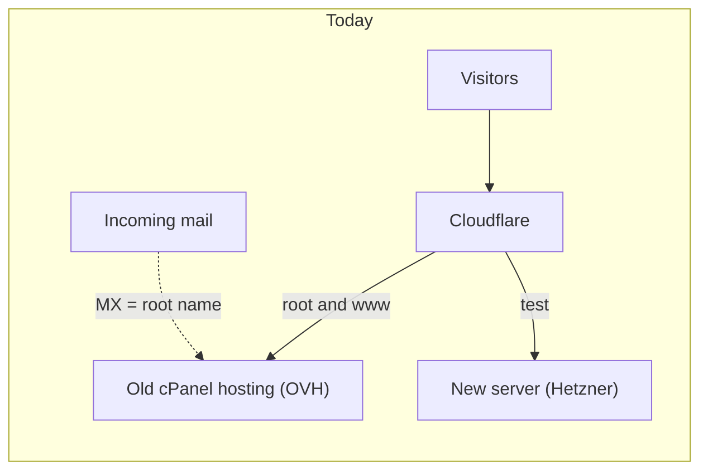
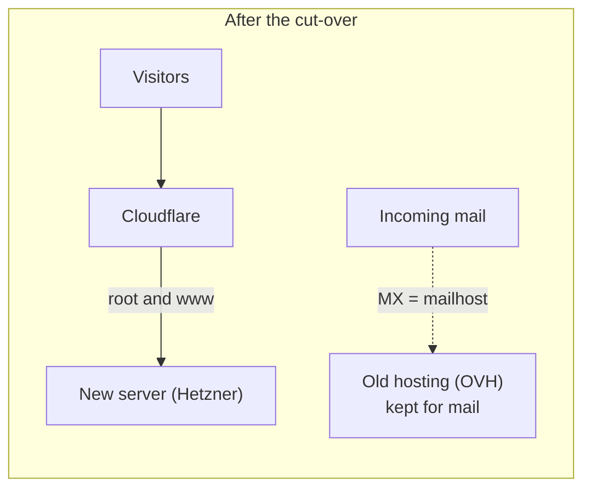

# 08 · Cut-over: moving the real domain to the new site

Until now the new site lived on a test address (`test.oluwabamiseomolaso.com.ng`)
while `oluwabamiseomolaso.com.ng` still showed an old, almost empty WordPress site. This
doc explains how we switch the real domain, in an order that cannot leave visitors on a
broken page and that can be undone in seconds.

> **Status: in progress.** Steps 1 to 4 are done and verified (section 8). Step 5, the
> switch itself, is next.

---

## 1. What exists today (read from the live DNS, 3 October 2026)

| Name | Points to | Notes |
|---|---|---|
| `oluwabamiseomolaso.com.ng` (the "root" or "apex") | The old cPanel hosting at OVH | Proxied by Cloudflare |
| `www` | A **CNAME** to the root | So `www` always follows the root |
| `cpanel`, `whm`, `webmail`, `webdisk`, `cpcalendars`, `cpcontacts` | The old hosting | Control panels for that hosting |
| `mail`, `ftp` | CNAMEs to the root | Follow the root (see section 3) |
| `MX` on the root | The root name | Where mail for the domain is delivered (see section 3) |
| `send` (MX and TXT), `resend._domainkey` | Resend / Amazon SES | Lets Resend send our email. **Never touch these** |
| `default._domainkey`, `_dmarc`, root SPF `TXT` | Mail signing and policy | Leave alone |
| `test` | The new server | Managed by Terraform |

The old WordPress site holds only the default "Sample Page" and "Hello world!" post,
so there are **no old web addresses worth redirecting**.



## 2. The key idea: the root name does two jobs

The root name is used by **web visitors** (we want them on the new server) and, through
the `MX` record, by **incoming email** (we want it left alone). Today both jobs follow
the same `A` record. If we simply move the `A` record to the new server, any mail
sent to `@oluwabamiseomolaso.com.ng`, **including replies to `contact@`**, would be sent
to the new server, which does not accept mail, and be lost without any error showing on
the website.

So we first give mail its **own name**, then move the website.



## 3. Step by step

| # | Step | Who | Risk |
|---|---|---|---|
| 1 | Add the new domain to the **reCAPTCHA** key's allowed domains | You | None (done) |
| 2 | **Give mail its own name** (section 4) | You, in the Cloudflare dashboard | Low, reversible |
| 3 | Pull request: Ingress for the root and `www`, `www` redirect. The **certificate is issued now**, before any traffic moves | Me | None: DNS still points at the old site |
| 4 | Set the site URL variables to the real domain, build and release a new image | Me | Low |
| 5 | **Import** the root record into Terraform and apply (section 6) | You run it | The switch itself |
| 6 | Verify (section 7), then put **Cloudflare Access** in front of `/admin` (section 9) | Both | Low |
| 7 | Keep the old hosting for now; decide later (section 10) | You | None |

## 4. Step 2 in detail: give mail its own name

Do this in the Cloudflare dashboard, **DNS → Records**, for your domain.

1. **Add a record.** Type `A`, name `mailhost`, IPv4 address = the old hosting's address
   (open the existing root `A` record and copy its content), **Proxy status: DNS only**
   (the grey cloud). *Why grey:* Cloudflare's proxy only handles web traffic; mail
   must reach the server directly.
2. **Edit the `MX` record** on the root: change its mail server from
   `oluwabamiseomolaso.com.ng` to `mailhost.oluwabamiseomolaso.com.ng`. Keep the priority.
3. **Edit the `mail` CNAME**: target `mailhost.oluwabamiseomolaso.com.ng` (DNS only).
4. **Edit the `ftp` CNAME**: target `mailhost.oluwabamiseomolaso.com.ng` (DNS only).
5. **Check** (any terminal):
   ```bash
   dig +short MX oluwabamiseomolaso.com.ng @1.1.1.1      # shows mailhost...
   dig +short A mailhost.oluwabamiseomolaso.com.ng @1.1.1.1   # the old hosting's address
   ```

Do **not** change `send`, `resend._domainkey`, the root `TXT` records, or `_dmarc`.
Resend sends mail through the `send` name, so it is unaffected by any of this.

## 5. What the pull request in step 3 contains

| File | What it does |
|---|---|
| `50-ingress.yaml` | One Ingress for the root and test names. One **certificate** that lists three names: the root, `www` and `test`. cert-manager gets it with a DNS challenge, so it works before DNS moves |
| `55-www-redirect.yaml` | A Traefik *Middleware* that rewrites `https://www.…/path` to `https://oluwabamiseomolaso.com.ng/path` with a permanent redirect, and a second Ingress for the `www` name that uses it |

### Reading the redirect

| Line | Meaning |
|---|---|
| `kind: Middleware` | A small step a request passes through on its way to the app |
| `regex: ^https://www\.…/(.*)` | Matches the whole `www` address. `^` is the start, `\.` is a literal dot, `(.*)` captures everything after the first `/` |
| `replacement: https://oluwabamiseomolaso.com.ng/${1}` | The new address; `${1}` puts the captured path back |
| `permanent: true` | Answer `301`, so browsers and search engines remember it |
| annotation `router.middlewares: portfolio-www-to-apex@kubernetescrd` | Attaches the middleware: `<namespace>-<name>@kubernetescrd` |
| no `cert-manager.io/cluster-issuer` on the `www` Ingress | Only one Ingress should request the certificate. This one reuses the Secret |

## 6. Step 5 in detail: the switch

The root `A` record **already exists** (made by hand). If Terraform tried to create it,
Cloudflare would refuse ("record already exists"). So we first tell Terraform it exists:
an **import**. After that, Terraform sees the record's content differs from the code and
**updates it in place**.

Because the record is proxied, Cloudflare serves the change from its own edge within
seconds. We are not waiting for the world's DNS caches (which can take hours for
un-proxied records).

**The commands** (from your terminal, after pulling the merged code):

```bash
hetzner                                    # load the secrets (doc 01)
cd infra/terraform/envs/prod
ZONE=$(grep cloudflare_zone_id terraform.tfvars | cut -d'"' -f2)

# 1. Adopt the existing record. The last part is "<zone id>/<record id>".
terraform import 'module.dns.cloudflare_dns_record.this["apex"]' "$ZONE/<record-id>"

# 2. Review. Expected: 0 to add, 1 to change, 0 to destroy; only the record's
#    content (old hosting address to the new server) and its comment change.
terraform plan

# 3. The switch.
terraform apply
```

| Part | Meaning |
|---|---|
| `terraform import` | Records "this thing already exists" in Terraform's state, without changing it |
| `'module.dns.cloudflare_dns_record.this["apex"]'` | The address of the record in our code: module `dns`, resource `this`, entry `apex`. Single quotes stop the shell from reading the brackets and quotes |
| `$ZONE/<record-id>` | How the Cloudflare provider names a record: zone, a slash, the record |
| `terraform plan` | Shows what would change, changes nothing. **Read it before applying** |

**Finding the record's ID** (it is not a secret, but it is not committed either):

```bash
curl -s "https://api.cloudflare.com/client/v4/zones/$ZONE/dns_records?type=A&name=oluwabamiseomolaso.com.ng" \
  -H "Authorization: Bearer $CLOUDFLARE_API_TOKEN" | python3 -c 'import sys,json;print(json.load(sys.stdin)["result"][0]["id"])'
```

If you run `apply` *before* the import, Terraform tries to create the record and
Cloudflare answers "record already exists". Nothing is damaged; import, then plan again.

**Rollback:** run the same apply with the old address back in the code, or edit the
record in the dashboard. The old site is back within seconds.

## 7. Verify (checklist)

| Check | Expected |
|---|---|
| `curl -sI https://oluwabamiseomolaso.com.ng/` | `200`, new site |
| `curl -sI https://www.oluwabamiseomolaso.com.ng/blog` | `301` to `https://oluwabamiseomolaso.com.ng/blog` |
| Certificate | Covers the root, `www` and `test`; issued by Let's Encrypt |
| Contact form and newsletter | Work, and the emails arrive |
| Page source | Canonical and social-card links use the real domain |
| Email to `contact@` (if you use inbound mail) | Still arrives at the old hosting |

## 8. Verified results

Seen working on 3 October 2026:

| Step | Result |
|---|---|
| 2. Mail on its own name | `MX` now points at `mailhost`; `mail` and `ftp` follow it; `mailhost` resolves to the old hosting; the Resend records (`send` MX, `resend._domainkey`) are unchanged; the root website was untouched |
| 3. Certificate | `portfolio-tls` re-issued (revision 2) by Let's Encrypt and lists three names: the root, `www` and `test`, issued **before** any traffic moved |
| 3. `www` redirect | `https://www…/blog` answers `301` to `https://oluwabamiseomolaso.com.ng/blog`; the query string is kept; the root itself does not redirect. Tested straight against Traefik through a port-forward, because DNS had not moved yet |
| 4. Image with the real URL | Pages now carry `https://oluwabamiseomolaso.com.ng` as the canonical link and in the social-card tags |

**A testing gotcha worth remembering.** The first `www` test returned `200`, not `301`.
The test address had `:8443` in it (the local port), so the `Host` header was
`www…:8443`, and the redirect's pattern (which expects no port) rightly did not
match. Testing through a port-forward needs `curl --connect-to www.DOMAIN:443:127.0.0.1:8443`
so the `Host` header stays port-free. The redirect was fine; the test was wrong.

**A second one: our own IP changed again** in the middle (the third time in a day),
which made `kubectl` hang. See `runbooks/01-my-ip-changed.md`; the WireGuard tunnel in the
TODO list is the permanent fix.

## 9. Cloudflare Access in front of `/admin`

`/admin` is protected by the app's own login, which is rate limited. Cloudflare Access
adds a second gate **in front of the app**: nobody even reaches the login page without
first proving they are you (by a one-time code sent to your email). It is free for up to
50 users.

Steps (dashboard): **Zero Trust → Access → Applications → Add → Self-hosted**, for the
paths `/admin*`, `/login*` and `/api/admin*`, with a policy that allows only your email.
*Be careful with the paths:* only protect screens and APIs that are admin-only.

## 10. What about the old hosting?

It still carries the `mailhost` name (for incoming mail) and the cPanel panels. Do not
cancel it until you have decided what to do about incoming mail. A free option: Cloudflare
**Email Routing** forwards `@oluwabamiseomolaso.com.ng` mail to your normal inbox. Once that
works, the hosting can be cancelled.

## 11. Glossary

- **Apex / root domain:** the bare name, `oluwabamiseomolaso.com.ng`, without `www.`
- **A record:** a name to an IPv4 address. **CNAME:** a name that is an alias of another name.
- **MX record:** says where mail for the domain is delivered.
- **Proxied (orange cloud):** visitors talk to Cloudflare, which talks to the server. **DNS only (grey):** the name resolves straight to the server.
- **Import (Terraform):** tell Terraform that something already exists, so it manages it instead of trying to create it.
- **Canonical URL:** the one address search engines should treat as the page's real address.
