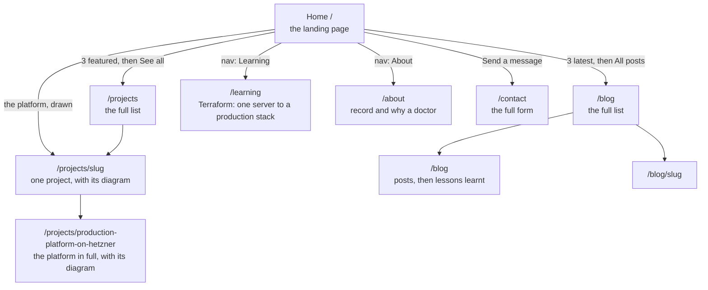

# 09 · How the site is organised, where each piece of content lives, and why

After the cut-over the home page had grown to about seventeen sections and said some
things twice. This doc explains the new shape: a short **landing page** that persuades,
and full pages that hold the detail. It also records the design rules we followed, and
where the logos, diagrams and copy come from.

> **Status: built and tested locally, not yet released.** Section 9 is filled in after
> the release.

---

## 1. The site map



The menu is **Home, Projects, Blog, Learning, About, Contact**. "How it's built" is not in the menu:
it is a **project** (the platform this site runs on). The home page draws that platform
with its tabs and a "Read how I built it" link; the case study itself lives on the
project's page under Projects. The old `/architecture` address redirects there (308,
permanent). What broke and what I learnt is a set of blog posts.

| Page | Job | Content comes from |
|---|---|---|
| `/` | Persuade: hero and moving tool logos, numbers, featured work, the platform drawn, how a change ships, the patterns I use, latest posts, one way to get in touch | The content file, plus the database for posts |
| `/projects`, `/projects/slug` | Every project; a project page shows its architecture diagram | The **database**, plus the content file for the diagrams |
| `/blog`, `/blog/slug` | Every post | The **database** |
| `/projects/production-platform-on-hetzner` | The platform in full: its diagram, explained in three steps | The content file, below the project's own text |
| `/learning` | Learning: the Terraform journey from one EC2 instance to a production stack, then every infrastructure pattern (the home page shows two) | The content file |
| `/blog` | Every post, including the six "lessons learnt" write-ups (seeded as real posts so you can edit them); the long-form write-up cards sit at the foot | The **database**, plus the content file for the cards |
| `/about` | Where I've worked, what I hold, why a doctor | The content file |
| `/contact` | The full contact form | Code (posts to `/api/contact`) |

## 2. Design rules we followed (and where they come from)

Three skill collections in the project folders were read for ideas: the
`taste-skill` set (landing pages and portfolios), `impeccable` (critique, distill,
clarify) and the `frontend-design` skill from the Upper Spring project. The rules that
changed this site:

| Rule | What it changed |
|---|---|
| **AIDA**: Attention, Interest, Desire, Action | The home page order: hero and tools, then numbers and projects and posts, then the teaching channel, then one contact action. "Why a doctor" lives only on `/about` |
| **The hero headline fits on two lines**, the text under it is 20 words or fewer, one main button | The hero was four lines of headline plus a long paragraph and three actions |
| **Say each idea once** (impeccable "distill") | Removed the "how it's built" teaser (it is a project now), the skills chips on the home page (the logo strip replaces them), the writing cards on `/about` (moved to the case study) and the repeated idle-cost claim |
| **Few eyebrows** (the small uppercase label above a heading) | Removed from the home sections; kept on the career pages |
| **One call to action per intent** | Hero: *See my work*. Contact: *Send a message*. Footer: the newsletter. No second "Work with me" |
| **Proof sits directly under the hero, never inside it** | The logo strip |
| **Real logos, not text wordmarks** | Section 4 |
| **Plain words**; a list of banned stock phrases | A test fails if "seamless", "leverage", "game-changer" and friends appear |

The brief still wins over the skills: the violet colour, which one skill calls an "AI
gradient" cliché, stays because it is the look you chose.

## 3. Two kinds of content, and why

| | Content file (`src/content/portfolio.ts`) | Database (admin panel) |
|---|---|---|
| Good for | Curated text that rarely changes and is reviewed in a pull request | Things you add often, without a code change |
| Changing it | Edit, open a PR, release | Log in to `/admin`, edit, save: live immediately |
| Examples | Results, the diagrams, links, logos | Blog posts, projects, and (since the Pages screen) the wording of Home, About, Learning and Contact, laid over the text in the code |

**The seven curated projects live in both places, on purpose.** The home page shows three
*featured* ones straight from the content file, so it never looks empty and never depends
on the database. `/projects` reads the database. A script copies the curated projects
into the database (section 5).

The home page cards use a short `blurb`; the project's own page uses the full `body`.

## 4. Logos

Logos come from two open collections and are **copied into the repository**
(`src/content/brand-icons.ts`), so there is no request to another site, no tracking and
no hotlinking:

| Source | Licence | Used for |
|---|---|---|
| Simple Icons (simpleicons.org) | CC0 (public domain) | Terraform, Ansible, Kubernetes, k3s, Argo CD, PostgreSQL, Cloudflare, Docker, GitHub Actions, Next.js, Hetzner and more |
| gilbarbara/logos (via `@iconify-json/logos`) | CC0 | AWS and OpenAI, which Simple Icons does not carry |

The logos belong to their owners; they appear only to name the tools used.

**How they are drawn.** `BrandIcon` draws each in the surrounding text colour, so it works
on both the dark and the light theme. Simple Icons gives a single path, drawn directly as
an SVG. The full-colour AWS and OpenAI art is drawn as a *mask*: the shape of the logo is
cut out of a block of the text colour (CSS `mask-image`), which turns any logo into a
one-colour silhouette.

| Piece | Job |
|---|---|
| `brandKey("Argo CD")` | Turns the name as written on the site into a logo key. A name with no logo returns nothing and is shown as plain text |
| `BrandIcon` | Draws one logo |
| `ToolChip` | A tool name with its logo, used on project cards |
| `ToolsStrip` | The "Technical tools" row (moving logos) under the hero |

To add a logo: find it at simpleicons.org, copy its path into `brand-icons.ts`, and add an
alias in `BrandIcon.tsx`.

## 5. Projects, the database, and the seed

Two scripts turn the content file into SQL: `generate-projects-seed.ts` (the seven projects) and `generate-posts-seed.ts` (the six "found and fixed" write-ups, as published blog posts). Both work the same way; the projects one is shown:

```bash
npx tsx scripts/generate-projects-seed.ts      # writes prisma/seed-projects.sql
```

| Part of the SQL | Meaning |
|---|---|
| `INSERT INTO "projects" (...) VALUES (...)` | Add rows |
| `gen_random_uuid()::text` | The database makes each row's id (the column has no default of its own) |
| `ARRAY['AWS', 'Terraform']::TEXT[]` | A list of technologies, in Postgres's array form |
| `ON CONFLICT ("slug") DO NOTHING` | If a project with that address exists, **skip it**, so running it again never overwrites one you edited in the admin panel |

A test fails if the committed SQL drifts from the content file. Run it locally with
`npx prisma db execute --file prisma/seed-projects.sql --schema prisma/schema.prisma`
(without `--schema` it only prints its help). On the cluster, use the one-off Job in
`infra/k8s/ops/seed-content.yaml` (the commands are in its header). It was tried through
the real migrator image against a local database: empty table, seven rows, seven again on
the second run.

## 6. Diagrams on the projects

A project shows an **architecture view** if its slug is in `projectViews`
(`src/content/project-views.ts`): a diagram plus tabs that explain the parts of it.

| Project | Diagram | Tabs |
|---|---|---|
| Production platform on Hetzner | `hetznerStack` (new, drawn from the real infrastructure code) | 1. A visitor arrives, 2. I ship a change, 3. The data stays safe |
| Cloud portfolio on AWS | `awsStack`, drawn as paused | Overview, then the five steps of the story |
| Self-hosted automation on a VPS | `vpsStack` | Request path, Backups, Hardening |
| The other four | Not drawn yet | |

To give another project a diagram: draw a `Diagram` in `architecture.ts`, write its tabs
in `project-views.ts`, and add its slug. The diagrams are our own SVG engine, so there is
no drawing tool to learn. The tests check that nothing is drawn outside the canvas,
that every step points at things that exist, and that the Hetzner diagram makes only
claims we verified (a Cloudflare-only firewall, backups kept 30 days) and none we did not
(no encryption, no autoscaling, no managed database).

**One rule was relaxed.** The tests used to ban the word "Hetzner" from the page, to avoid
naming the host. The platform is now a featured project, so the word is allowed. Still
banned: IP addresses, host names, key paths and secrets.

## 7. Making the older pages match the redesign

The blog, projects, contact, login and admin pages were written with Tailwind's default
grey, purple and indigo. Instead of editing each page, the theme is changed **once** in
`tailwind.config.js`:

| Change | Effect |
|---|---|
| `gray` redefined to the redesign's palette | Every `bg-gray-*`, `text-gray-*`, `border-gray-*` changes together |
| `purple` and `indigo` set to the redesign's violet | Accents and the admin's buttons match the home page |
| `fontFamily.sans` starts with the redesign's body font; `h1`, `h2` use the display font | Text matches |
| The font variables are on `<body>` | Fonts are available on every page |

The home page does not use Tailwind's colours (it has its own `.pf` variables), so it is
unaffected. The values are copied from `app/portfolio.css`; change one, change both.

## 8. Cloudflare Access and the admin paths

Access gates `/admin`, `/login`, `/api/admin`, `/api/auth`, `/api/email-auth`,
`/api/subscribers` and `/api/newsletters`. The unused duplicate `/api/subscribers/export`
was deleted (the Subscribers screen has *Export CSV*), so the `api/subscribers` entry is
harmless and can be removed.

## 9. Verified results

*To be filled in after the release.*

## 10. The admin panel

The admin panel (`/admin`) has its own sidebar layout, in three groups:

| Group | Screens |
|---|---|
| Content | **Overview**, **Pages**, **Blog**, **Projects** |
| Audience | **Messages** (contact-form inbox), **Subscribers**, **Newsletters** |
| Site | **Analytics** |

**Blog and Projects** share one list (`ContentList`): tabs for All, Published, Drafts and
Scheduled with counts, a search box, and on each row Edit, View (published items), Publish
or Unpublish, and Delete. Before, the projects list asked the public API, which only
returns published projects, so a draft project could not be seen in the admin; there is
now an admin-only `GET /api/admin/projects` that returns every status.

**Pages** edits the wording of Home, About, Learning and Contact:

| Piece | Job |
|---|---|
| `src/content/editable.ts` | The list of editable text, found by walking the content file. Links, addresses, logos and the patterns' drawing data are not in the list, so they cannot be edited |
| `site_content` table | One row per edited field: `key` (a dotted path such as `homeHero.intro`) and `value`. No row means "use the text in the code" |
| `withOverrides(root, defaults, edits)` | Returns a copy of the defaults with the edits laid over. It only replaces text at listed paths, so an edit can never change the shape of a page |
| `getOverrides()` | Reads all edits once per request; if the database is down it returns none, and the page shows the text in the code |
| `GET/PUT /api/admin/pages/[page]` | Read a page's fields (default and current text); save changes. Saving the original text, or an empty box, deletes the edit ("Reset to original") |

The four public pages are now rendered on each request (`dynamic = "force-dynamic"`), so a
saved edit is live at once and the image build needs no database.

**Messages** lists what the contact form saved: open one to read it (it is marked read),
reply by email (marks it replied), or delete it.

### Sending a newsletter

Open a saved newsletter: the **Send** box on the right has two buttons.

| Button | What it does |
|---|---|
| **Send me a test copy** | One email to your own admin address, subject starting `[Test]`. Nothing is recorded, so you can do it as often as you like. If it fails, the screen shows Resend's reason (for example "API key is invalid") |
| **Choose recipients & send** | Opens a list of everyone currently subscribed. **Nothing is ticked at first**, so a send is always a decision. Search, tick people, or *Select all*; people who already received this issue are greyed out. Then a second confirmation, then it goes |

| Piece | Job |
|---|---|
| `GET /api/admin/newsletters/[id]/recipients` | Active subscribers, and whether each already got this issue |
| `POST /api/admin/newsletters/[id]/send` | `{ test: true }` or `{ subscriberIds: [...] }`. Skips anyone unsubscribed or already sent, marks the newsletter `sending`, answers `202` at once and carries on in the background |
| `src/lib/newsletter-send.ts` | Builds one email per person (their own unsubscribe link, `{name}` filled in, picture addresses made absolute, message sanitised) and sends them one at a time, 0.6 s apart, because Resend allows about two requests a second. Every attempt is saved in `newsletter_sends`, which the database keeps to one row per newsletter and person |

Why in the background: Cloudflare gives up on a web request after 100 seconds, and a long
list takes longer than that. The screen shows a progress bar (it polls every two seconds)
and you can leave the page. When it finishes the newsletter is **Sent** if anyone received
it; if every email failed it goes back to **Draft** so you can retry (failed people can be
chosen again; successful ones cannot be sent a duplicate). While sending, editing and
deleting are blocked. If the server restarts mid-send, the newsletter stays `sending`: set
it back with `update newsletters set status='draft' where id=...;` and send to the
remaining people.

Unsubscribe links in newsletters no longer expire (the old 30-day limit would have broken
the link in older emails). Scheduling a newsletter for later was removed from the form:
nothing sent it at the chosen time, so the option would have been misleading.

### Tracking what happened to each email

The **Newsletters** list works like the Blog list: tabs (All, Drafts, Sending, Sent) with
counts, a search box, and on each row **Edit**, **Send** (opens the recipient chooser
straight from the list; *Send to more* once it has gone out), **Report** and **Delete**.
A sent newsletter shows its results under the title, and **Report** opens the full table.

| Count | Meaning |
|---|---|
| **Delivered** | Reached the inbox (Resend's `email.delivered`) |
| **Opened** | The picture Resend adds was loaded (`email.opened`), so it counts as read |
| **Not opened** | Delivered, not opened yet |
| **Bounced** | Sent but could not be delivered: wrong or dead address (`email.bounced`) |
| **Failed** | Resend refused it when we tried to send (for example a malformed address) |
| **Waiting** | Resend has accepted it but has not reported back yet |

Two honest limits. **"Opened" is an estimate**: mail apps that block pictures hide real
reads, and some (Apple Mail) load them automatically, which counts as a read when nobody
looked. And results arrive from Resend after the send, usually within minutes.

Two automatic actions protect your sender reputation: a **permanent bounce** (the address
does not exist) and a **spam report** both unsubscribe that person (shown in Subscribers
as unsubscribed, with the reason), so you never write to them again. A temporary bounce
(a full mailbox) does not.

How the reports reach the site:

| Piece | Job |
|---|---|
| `newsletter_sends` columns `resend_id`, `delivered_at`, `opened_at`, `bounced_at`, `bounce_reason`, `complained_at` | The email's id at Resend (saved when it is sent) and the times Resend reports |
| `POST /api/webhooks/resend` | Resend calls this. It is public (Resend cannot sign in), so the **signature is the gate**: a Svix-style HMAC over `id.timestamp.body` with your signing secret, refused if wrong or older than 5 minutes. Without the secret set it answers 503 and reads nothing |
| `src/lib/resend-webhook.ts` | `verifySignature` and `applyEvent` (matches the event to a send by `resend_id`; ignores other emails such as contact-form mail; never overwrites an earlier time) |
| `src/lib/newsletter-stats.ts` | Turns the records into the counts above |
| `GET /api/admin/newsletters/[id]/report` | The per-person table behind **Report** |

**Turning it on (once):**

1. Resend dashboard → *Domains* → your domain → switch **Open tracking** on (it is off by
   default; without it there are no "Opened" results).
2. Resend dashboard → *Webhooks* → *Add webhook*: address
   `https://oluwabamiseomolaso.com.ng/api/webhooks/resend`, events **email.delivered,
   email.opened, email.bounced, email.complained**. Copy the *Signing secret* (`whsec_…`).
3. ```bash
   export KUBECONFIG=~/.kube/hetzner-portfolio.yaml
   bash infra/scripts/create-webhook-secret.sh
   kubectl -n portfolio rollout restart deployment/portfolio
   ```
4. Send a test newsletter to yourself and watch it go from *Waiting* to *Delivered* in
   the report. Resend's webhook page also has a *Send test event* button.

Cloudflare Access protects `/api/admin` but not `/api/webhooks`, which is what lets Resend
reach it. Check that no Access rule covers `/api/webhooks`.

## 11. Analytics (replaces "Performance")

The old Performance screen held two things that were already covered elsewhere or never
worked: newsletter results (now each newsletter's **Report**) and website speed numbers
that **nothing was collecting** (the code that sent them was never switched on, and the
Google Analytics snippet was never loaded either, so there was no data). Both were removed;
`/admin/performance` redirects to **Analytics**.

**Analytics** counts visits itself, so it works without Google and without a consent
banner:

| Piece | Job |
|---|---|
| `src/components/PageViewTracker.tsx` | In the public pages. Sends one small message per page view (the page, the referring site; the first view also carries load time, TTFB and LCP). Skips the admin panel and browsers set to Do Not Track |
| `POST /api/analytics/collect` | Public. Ignores crawlers and link previews, the signed-in admin (so your own visits do not count), the admin and API paths, and anything malformed. Always answers 204, so analytics can never slow or break a page. Rate limited |
| `page_views` table | path, referring site (name only), country (from Cloudflare's `CF-IPCountry`), device type, a daily visitor hash, and the three timings. **No IP address, no cookie** |
| `src/lib/analytics.ts` | `visitorHash` (HMAC of address + browser + date with the site secret: stable for a day, then a new stranger, and not reversible), bot, device, path and referrer helpers |
| `GET /api/admin/analytics?days=7|30|90` | Totals, per-day series, top pages, referrers, countries, devices |

The page shows: visitors (one per person per day), page views, **LCP** (how long the main
content takes to appear: under 2.5 s is *Good*, over 4 s is *Slow*, measured on the slowest
quarter of visits), the typical full load time, a visits-per-day chart, a per-page table
with a speed verdict, and where visitors come from.

What it cannot tell you, honestly: it only sees visitors whose browsers run scripts; a
visitor is "new" every day, so returning-visitor figures are not possible; **country needs
the site to be behind Cloudflare** (it is on the live site; locally the list stays empty);
and old rows in `performance_metrics` and `lcp_metrics` (always empty) were left in the
database rather than dropped. The privacy policy now explains this counting.

## 12. Flow strips

Each curated project has a `flow` (in `portfolio.ts`): a short chain of named steps such
as Visitor, Cloudflare, Traefik, Next.js, PostgreSQL. `FlowStrip` draws it with a logo
where a step is a known tool, on the home cards, `/projects` and each project page. It is
a one-line version of the full diagram, not a replacement for it.

## 13. Glossary

- **Landing page:** the page most visitors see first; its job is to get them to act.
- **AIDA:** Attention, Interest, Desire, Action: the order a persuasive page follows.
- **Eyebrow:** the small label above a heading.
- **Case study:** the full story of one project: what, why, how, what broke.
- **Seed:** loading starting data into a database. **Idempotent:** safe to run twice.
- **Slug:** the URL-safe name of an item (`cloud-portfolio-on-aws`).
- **Mask (CSS):** using a shape as a stencil, so a block of colour shows only through it.
- **Override:** text saved in the database that replaces the default text in the code.
- **Inbox:** here, the Messages screen listing what the contact form saved.
