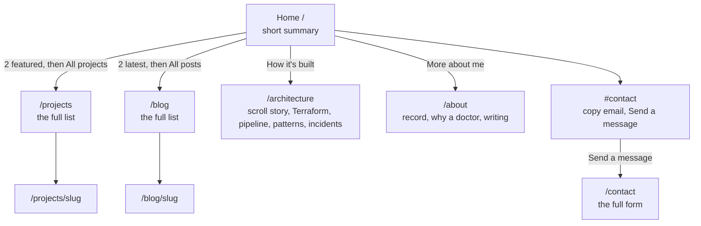

# 09 · How the site is organised, and where each piece of content lives

After the cut-over the home page had grown to about seventeen sections. This doc
explains the new shape: a short home page that **summarises**, with each section
linking to a full page that holds the detail.

> **Status: built and tested locally, not yet released.** Section 7 is filled in after
> the release.

---

## 1. The site map



| Page | What it is | Where its content comes from |
|---|---|---|
| `/` | Hero, results, two featured projects, "how it's built" teaser, latest posts, skills, YouTube, contact | The content file for most; the database for posts |
| `/projects`, `/projects/slug` | Every project, filterable by technology | The **database** (managed in the admin panel) |
| `/blog`, `/blog/slug` | Every post | The **database** |
| `/architecture` | The detail that used to crowd the home page | The content file |
| `/about` | Where I've worked, what I hold, why a doctor, building in public | The content file |
| `/contact` | The full contact form | Code (the form posts to `/api/contact`) |

## 2. Two kinds of content, and why

| | Content file (`src/content/portfolio.ts`) | Database (admin panel) |
|---|---|---|
| Good for | Curated text that rarely changes and is reviewed in a pull request | Things you add often, without a code change |
| Changing it | Edit the file, open a PR, release | Log in to `/admin`, edit, save: live immediately |
| Examples | Hero text, results, skills, the curated projects | Blog posts, projects |

**The curated projects live in both places, on purpose.** The home page shows two
*featured* ones straight from the content file, so it never looks empty and never
depends on the database. `/projects` reads the database. To make the two agree, the six
curated projects are copied into the database once (section 3).

## 3. Keeping the database and the content file in step

A script turns the content file into SQL:

```bash
npx tsx scripts/generate-projects-seed.ts      # writes prisma/seed-projects.sql
```

The SQL is `INSERT ... ON CONFLICT ("slug") DO NOTHING`. Reading it:

| Part | Meaning |
|---|---|
| `INSERT INTO "projects" (...) VALUES (...)` | Add rows |
| `gen_random_uuid()::text` | The database makes each row's id (the column has no default of its own) |
| `ARRAY['AWS', 'Terraform']::TEXT[]` | A list of technologies, in Postgres's array form |
| `ON CONFLICT ("slug") DO NOTHING` | If a project with that address already exists, **skip it**. So running the seed again never overwrites a project you edited in the admin panel |

A test (`projects-seed.test.ts`) fails if the committed SQL no longer matches the content
file, so the two cannot drift apart unnoticed.

**Locally:**

```bash
npx prisma db execute --file prisma/seed-projects.sql --schema prisma/schema.prisma
```

(`db execute` needs `--schema` to find the database address; without it, it only prints
its help text.)

**On the cluster**, once, with a Job that is deliberately *not* managed by ArgoCD
(`infra/k8s/ops/seed-projects.yaml`, like the restore test). The commands are in the
file's header. It runs the Prisma command line from the migrator image, which already
contains the `prisma` folder and the database address from the same Secret as the app.
It was tried through the real image against a local database: empty table, then six
rows, then six rows again after a second run.

## 4. Making the older pages match the redesign

The blog, projects, contact, login and admin pages were written with Tailwind's default
grey and purple (and indigo for admin buttons). Instead of editing each page, the theme
is changed **once** in `tailwind.config.js`:

| Change | Effect |
|---|---|
| `gray` redefined to the redesign's palette (`950` is the page background `#07070f`, `900` the cards, `700` the borders, `400` the muted text) | Every `bg-gray-*`, `text-gray-*` and `border-gray-*` on every older page changes together |
| `purple` and `indigo` both set to the redesign's violet (`500` is `#9b7bff`) | Accents and buttons match the home page |
| `fontFamily.sans` starts with the redesign's body font | Body text matches |
| `h1`, `h2` use the redesign's display font (in `globals.css`) | Headings match |
| The font variables are put on `<body>` (in `layout.tsx`) | The fonts are available on every page, not only the home page |

The home page does not use Tailwind's colours (it has its own `.pf` styles and
variables), so it is unaffected. The values are copied from the home page's tokens in
`app/portfolio.css`; if you change one there, change it here too.

**One small fix made on the way:** a project with no cover image used to render a
broken-image box on `/projects`. It now shows a thin gradient strip instead.

## 5. Cloudflare Access and the admin paths

Access gates `/admin`, `/login`, `/api/admin`, `/api/auth`, `/api/email-auth`,
`/api/subscribers` and `/api/newsletters`. The `/api/subscribers/export` endpoint behind
that fourth-to-last entry was a duplicate of the **Export CSV** button on the Subscribers
screen, and nothing used it, so it was deleted. The `api/subscribers` Access entry is
now harmless and can be removed.

## 6. Adding things

| To add | Do this |
|---|---|
| A blog post or project | Sign in at `/admin`, create it, set it to **published** |
| A new curated project (featured on the home page) | Add it to `projects` in the content file, run the generator, commit both, release, run the seed Job |
| A section to the home page | Add a component and put it in `src/app/page.tsx` (keep it short and link to a full page) |

## 7. Verified results

*To be filled in after the release.*

## 8. Glossary

- **Summary page:** a page that shows a little of everything and links to the detail.
- **Seed:** loading starting data into a database.
- **Idempotent:** safe to run more than once; the second run changes nothing.
- **Slug:** the URL-safe name of an item (`cloud-portfolio-on-aws`).
- **Design tokens:** named values (colours, fonts) defined once and reused.
