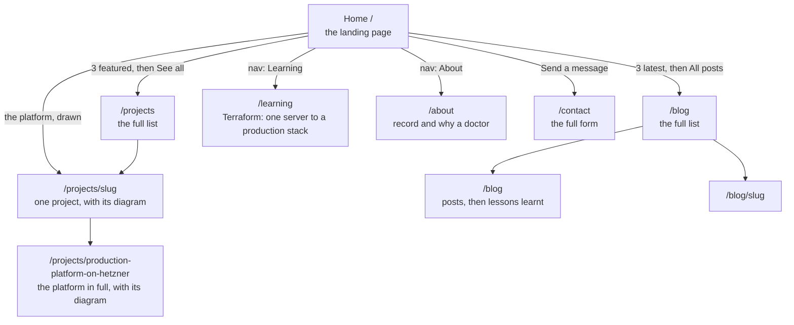

# 09 · How the site is organised, where each piece of content lives, and why

After the cut-over the home page had grown to about seventeen sections and said some
things twice. This doc explains the new shape: a short **landing page** that persuades,
and full pages that hold the detail. It also records the design rules we followed, and
where the logos, diagrams and copy come from.

> **Status: built and tested locally, not yet released.** Section 9 is filled in after
> the release.

---

## 1. The site map



The menu is **Home, Projects, Blog, Learning, About, Contact**. "How it's built" is not in the menu:
it is a **project** (the platform this site runs on). The home page draws that platform
with its tabs and a "Read how I built it" link; the case study itself lives on the
project's page under Projects. The old `/architecture` address redirects there (308,
permanent). What broke and what I learnt sits at the foot of the blog.

| Page | Job | Content comes from |
|---|---|---|
| `/` | Persuade: hero and moving tool logos, numbers, featured work, the platform drawn, how a change ships, the patterns I use, latest posts, one way to get in touch | The content file, plus the database for posts |
| `/projects`, `/projects/slug` | Every project; a project page shows its architecture diagram | The **database**, plus the content file for the diagrams |
| `/blog`, `/blog/slug` | Every post | The **database** |
| `/projects/production-platform-on-hetzner` | The platform in full: its diagram, explained in three steps | The content file, below the project's own text |
| `/learning` | Learning: the Terraform journey from one EC2 instance to a production stack, then every infrastructure pattern (the home page shows two) | The content file |
| `/blog` (foot of the page) | Lessons: incidents and what changed, plus the long-form write-ups | The content file |
| `/about` | Where I've worked, what I hold, why a doctor | The content file |
| `/contact` | The full contact form | Code (posts to `/api/contact`) |

## 2. Design rules we followed (and where they come from)

Three skill collections in the project folders were read for ideas: the
`taste-skill` set (landing pages and portfolios), `impeccable` (critique, distill,
clarify) and the `frontend-design` skill from the Upper Spring project. The rules that
changed this site:

| Rule | What it changed |
|---|---|
| **AIDA**: Attention, Interest, Desire, Action | The home page order: hero and tools, then numbers and projects and posts, then the teaching channel, then one contact action. "Why a doctor" lives only on `/about` |
| **The hero headline fits on two lines**, the text under it is 20 words or fewer, one main button | The hero was four lines of headline plus a long paragraph and three actions |
| **Say each idea once** (impeccable "distill") | Removed the "how it's built" teaser (it is a project now), the skills chips on the home page (the logo strip replaces them), the writing cards on `/about` (moved to the case study) and the repeated idle-cost claim |
| **Few eyebrows** (the small uppercase label above a heading) | Removed from the home sections; kept on the career pages |
| **One call to action per intent** | Hero: *See my work*. Contact: *Send a message*. Footer: the newsletter. No second "Work with me" |
| **Proof sits directly under the hero, never inside it** | The logo strip |
| **Real logos, not text wordmarks** | Section 4 |
| **Plain words**; a list of banned stock phrases | A test fails if "seamless", "leverage", "game-changer" and friends appear |

The brief still wins over the skills: the violet colour, which one skill calls an "AI
gradient" cliché, stays because it is the look you chose.

## 3. Two kinds of content, and why

| | Content file (`src/content/portfolio.ts`) | Database (admin panel) |
|---|---|---|
| Good for | Curated text that rarely changes and is reviewed in a pull request | Things you add often, without a code change |
| Changing it | Edit, open a PR, release | Log in to `/admin`, edit, save: live immediately |
| Examples | Hero text, results, the curated projects, the diagrams | Blog posts, projects |

**The seven curated projects live in both places, on purpose.** The home page shows three
*featured* ones straight from the content file, so it never looks empty and never depends
on the database. `/projects` reads the database. A script copies the curated projects
into the database (section 5).

The home page cards use a short `blurb`; the project's own page uses the full `body`.

## 4. Logos

Logos come from two open collections and are **copied into the repository**
(`src/content/brand-icons.ts`), so there is no request to another site, no tracking and
no hotlinking:

| Source | Licence | Used for |
|---|---|---|
| Simple Icons (simpleicons.org) | CC0 (public domain) | Terraform, Ansible, Kubernetes, k3s, Argo CD, PostgreSQL, Cloudflare, Docker, GitHub Actions, Next.js, Hetzner and more |
| gilbarbara/logos (via `@iconify-json/logos`) | CC0 | AWS and OpenAI, which Simple Icons does not carry |

The logos belong to their owners; they appear only to name the tools used.

**How they are drawn.** `BrandIcon` draws each in the surrounding text colour, so it works
on both the dark and the light theme. Simple Icons gives a single path, drawn directly as
an SVG. The full-colour AWS and OpenAI art is drawn as a *mask*: the shape of the logo is
cut out of a block of the text colour (CSS `mask-image`), which turns any logo into a
one-colour silhouette.

| Piece | Job |
|---|---|
| `brandKey("Argo CD")` | Turns the name as written on the site into a logo key. A name with no logo returns nothing and is shown as plain text |
| `BrandIcon` | Draws one logo |
| `ToolChip` | A tool name with its logo, used on project cards |
| `ToolsStrip` | The "Technical tools" row (moving logos) under the hero |

To add a logo: find it at simpleicons.org, copy its path into `brand-icons.ts`, and add an
alias in `BrandIcon.tsx`.

## 5. Projects, the database, and the seed

A script turns the content file into SQL:

```bash
npx tsx scripts/generate-projects-seed.ts      # writes prisma/seed-projects.sql
```

| Part of the SQL | Meaning |
|---|---|
| `INSERT INTO "projects" (...) VALUES (...)` | Add rows |
| `gen_random_uuid()::text` | The database makes each row's id (the column has no default of its own) |
| `ARRAY['AWS', 'Terraform']::TEXT[]` | A list of technologies, in Postgres's array form |
| `ON CONFLICT ("slug") DO NOTHING` | If a project with that address exists, **skip it**, so running it again never overwrites one you edited in the admin panel |

A test fails if the committed SQL drifts from the content file. Run it locally with
`npx prisma db execute --file prisma/seed-projects.sql --schema prisma/schema.prisma`
(without `--schema` it only prints its help). On the cluster, use the one-off Job in
`infra/k8s/ops/seed-projects.yaml` (the commands are in its header). It was tried through
the real migrator image against a local database: empty table, seven rows, seven again on
the second run.

## 6. Diagrams on the projects

A project shows an **architecture view** if its slug is in `projectViews`
(`src/content/project-views.ts`): a diagram plus tabs that explain the parts of it.

| Project | Diagram | Tabs |
|---|---|---|
| Production platform on Hetzner | `hetznerStack` (new, drawn from the real infrastructure code) | 1. A visitor arrives, 2. I ship a change, 3. The data stays safe |
| Cloud portfolio on AWS | `awsStack`, drawn as paused | Overview, then the five steps of the story |
| Self-hosted automation on a VPS | `vpsStack` | Request path, Backups, Hardening |
| The other four | Not drawn yet | |

To give another project a diagram: draw a `Diagram` in `architecture.ts`, write its tabs
in `project-views.ts`, and add its slug. The diagrams are our own SVG engine, so there is
no drawing tool to learn. The tests check that nothing is drawn outside the canvas,
that every step points at things that exist, and that the Hetzner diagram makes only
claims we verified (a Cloudflare-only firewall, backups kept 30 days) and none we did not
(no encryption, no autoscaling, no managed database).

**One rule was relaxed.** The tests used to ban the word "Hetzner" from the page, to avoid
naming the host. The platform is now a featured project, so the word is allowed. Still
banned: IP addresses, host names, key paths and secrets.

## 7. Making the older pages match the redesign

The blog, projects, contact, login and admin pages were written with Tailwind's default
grey, purple and indigo. Instead of editing each page, the theme is changed **once** in
`tailwind.config.js`:

| Change | Effect |
|---|---|
| `gray` redefined to the redesign's palette | Every `bg-gray-*`, `text-gray-*`, `border-gray-*` changes together |
| `purple` and `indigo` set to the redesign's violet | Accents and the admin's buttons match the home page |
| `fontFamily.sans` starts with the redesign's body font; `h1`, `h2` use the display font | Text matches |
| The font variables are on `<body>` | Fonts are available on every page |

The home page does not use Tailwind's colours (it has its own `.pf` variables), so it is
unaffected. The values are copied from `app/portfolio.css`; change one, change both.

## 8. Cloudflare Access and the admin paths

Access gates `/admin`, `/login`, `/api/admin`, `/api/auth`, `/api/email-auth`,
`/api/subscribers` and `/api/newsletters`. The unused duplicate `/api/subscribers/export`
was deleted (the Subscribers screen has *Export CSV*), so the `api/subscribers` entry is
harmless and can be removed.

## 9. Verified results

*To be filled in after the release.*

## 10. Glossary

- **Landing page:** the page most visitors see first; its job is to get them to act.
- **AIDA:** Attention, Interest, Desire, Action: the order a persuasive page follows.
- **Eyebrow:** the small label above a heading.
- **Case study:** the full story of one project: what, why, how, what broke.
- **Seed:** loading starting data into a database. **Idempotent:** safe to run twice.
- **Slug:** the URL-safe name of an item (`cloud-portfolio-on-aws`).
- **Mask (CSS):** using a shape as a stencil, so a block of colour shows only through it.

## 11. Flow strips

Each curated project has a `flow` (in `portfolio.ts`): a short chain of named steps such
as Visitor, Cloudflare, Traefik, Next.js, PostgreSQL. `FlowStrip` draws it with a logo
where a step is a known tool, on the home cards, `/projects` and each project page. It is
a one-line version of the full diagram, not a replacement for it.
