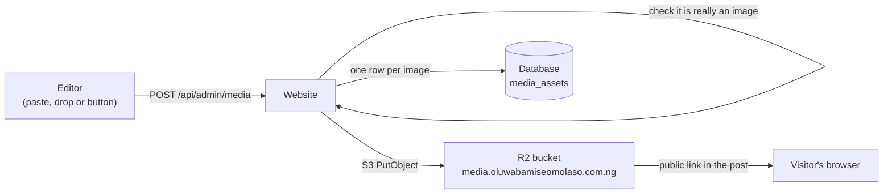

# 10 · Images in posts: uploads, storage and removal

You can write a post or project, drop a picture into the text, and it appears. The
picture is stored in **Cloudflare R2** (an S3-compatible bucket, like the ones already used
for backups), and the page links to it. You can delete any picture at any time from the
**Media** screen in the admin panel.

> **Status: built and tested locally. The bucket and its secret are not created yet**, so
> on the live site uploads stay switched off until you do section 3.

---

## 1. How it works



| Step | What happens |
|---|---|
| Add a picture | Toolbar button, paste, or drag into the text. Several at once are fine |
| Checks | Sign-in (and the usual request-origin check) first. Then the file's **first bytes** decide what it is, not its name: JPG, PNG, GIF, WebP and AVIF only. **SVG is refused** because it can carry scripts. Maximum 5 MB |
| Stored as | `uploads/2026/10/<random uuid>.png`: an unguessable name, kept forever with a one-year cache header |
| In the post | The text holds only the address (`https://media…/uploads/…png`), never the picture itself. Pasted base64 pictures are not allowed |
| Remove | **Admin → Media**: the grid shows each picture, where it is used, **Copy link**, and a delete button. Deleting removes the file from the bucket and its row. If a post still uses it, you are warned first and that post shows a broken picture |

## 2. Where the pieces are

| File | Job |
|---|---|
| `src/lib/image-upload.ts` | `detectImage` (what the bytes are), the 5 MB limit, tidy file names |
| `src/lib/storage.ts` | `putObject`, `deleteObject`, `newKey`. R2 when the `R2_*` settings exist; otherwise a local folder `public/uploads` (development only, never in production) |
| `src/app/api/admin/media/route.ts`, `[id]/route.ts` | List (with "used in" counts), upload, delete |
| `src/components/admin/RichEditor.tsx` | The writing box: toolbar, paste/drop upload, word count |
| `src/components/admin/forms.tsx` | `ImageField` (cover pictures), `TagInput`, `Field`, `Panel` |
| `src/components/admin/EntryForm.tsx`, `NewsletterForm.tsx` | One form for posts and projects; one for newsletters |
| `prisma/migrations/…_media_assets` | The `media_assets` table |

## 3. Turning it on for the live site (once)

1. **Create the bucket.** Cloudflare dashboard → R2 → *Create bucket*, name it
   `portfolio-media`.
2. **Give it a public address.** In the bucket → *Settings* → *Custom domains* → add
   `media.oluwabamiseomolaso.com.ng`. (Do not use the `r2.dev` address: it is rate limited
   and meant for tests.) Cloudflare creates the DNS record and certificate itself.
3. **Create an access token for the website only.** R2 → *Manage API tokens* → *Create API
   token* → permission **Object Read & Write**, applied to **only the `portfolio-media`
   bucket**. Copy the *Access Key ID* and *Secret Access Key* (shown once). A token limited
   to this bucket cannot touch the backup bucket.
4. **Store them in the cluster.**
   ```bash
   export KUBECONFIG=~/.kube/hetzner-portfolio.yaml
   bash infra/scripts/create-media-secret.sh
   kubectl -n portfolio rollout restart deployment/portfolio
   ```
   It asks for the account ID, bucket name, public address and the two keys (typed at hidden
   prompts, kept only in the cluster).
5. **Check.** Admin → Media → *Upload images*; the picture should appear, and its address
   should start with `https://media.oluwabamiseomolaso.com.ng/`.

The Deployment reads this secret as **optional**, so the site deploys and runs before you
do any of this. Until then the Media screen says "Image storage is not set up" and uploads
return a clear error.

## 4. Safety notes

| Risk | How it is handled |
|---|---|
| Someone uploads without signing in | The route needs the admin session and passes the same request-origin check as other admin writes. Cloudflare Access also gates `/api/admin` |
| A script disguised as an image | The bytes are checked, SVG is refused, and the object is stored with the image type it was detected as |
| Huge files | 5 MB cap, checked from the header and again on the bytes |
| A broken upload leaves a stray file | If saving the database row fails, the stored file is deleted |
| Images in newsletters | They are normal public links, so they load in email too |

## 5. Glossary

- **R2:** Cloudflare's object storage. S3-compatible, with no charge for downloads (egress).
- **Object / key:** a stored file, and its name inside the bucket.
- **Custom domain (R2):** a name you own (`media.…`) that serves the bucket publicly through Cloudflare.
- **Magic bytes:** the first few bytes of a file, which identify its real type.
