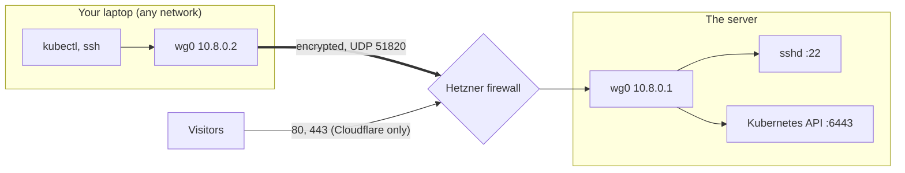

# 11 · WireGuard: a private tunnel, so your IP address stops mattering

Until now the server's SSH (port 22) and Kubernetes API (port 6443) only accepted
connections from IP addresses on an allow-list (`admin_cidrs`). Every time your network
changed, you were locked out and had to edit the list (see
`runbooks/01-my-ip-changed.md`). This doc replaces that with a **private tunnel**: you
connect to the server through an encrypted line that only your laptop's key can open, and
nothing depends on your IP.

> **Status: rolled out and working (3 October 2026).** See section 8 for what was seen
> working and what went wrong on the way. Follow section 5 in order when adding another
> device or rebuilding: it is built so that a mistake cannot lock you out. The public
> `admin_cidrs` doors are still open as a fallback (section 6).

---

## 1. The idea

**WireGuard** is a small, modern VPN (virtual private network) built into Linux. Each end
has a **key pair**: a *private key* (kept secret on that device) and a *public key* (safe to
share). Two devices that have each other's public key can talk through an encrypted tunnel.



- The tunnel has its own tiny private network: the server is **10.8.0.1**, your laptop is
  **10.8.0.2**. You point `ssh` and `kubectl` at `10.8.0.1`.
- Only traffic to `10.8.0.1` goes through the tunnel. Your normal browsing is untouched.
- The firewall opens **one** port to the world, **UDP 51820**. That is safe: WireGuard does
  not reply to any packet that is not signed by a key it knows, so to everyone else the
  port looks closed.

| Before | After |
|---|---|
| Firewall lists your IP for ports 22 and 6443 | Firewall lists nothing for you: you arrive through the tunnel |
| New network means locked out until you edit `admin_cidrs` | New network changes nothing: the tunnel reconnects by itself |
| Ports 22 and 6443 reachable (by listed IPs) from the internet | Can be closed to the internet entirely (section 6) |

## 2. What was added

| Piece | Where | Job |
|---|---|---|
| Firewall rule | `infra/terraform/modules/firewall` (`wireguard_port`, default 51820 in `envs/prod`) | Opens UDP 51820 to everyone. Set it to `null` to remove the rule |
| Ansible role `wireguard` | `infra/ansible/roles/wireguard` | Installs WireGuard, makes the server's key pair **on the server** (once; the private key never leaves it), writes `/etc/wireguard/wg0.conf` from your list of devices, starts the tunnel at boot |
| Playbook | `infra/ansible/playbooks/04-wireguard.yml` | Runs the role. Touches nothing about SSH or the firewall |
| k3s certificate | `infra/ansible/roles/k3s` (`tls-san` now lists `wireguard_server_ip`) | Makes `kubectl` accept the cluster's certificate when you connect to `10.8.0.1` |
| Laptop script | `infra/scripts/wireguard-client.sh` | Makes your key pair (private key stays in `~/.config/wireguard-hetzner`, readable by you alone) and writes the tunnel config |
| Device list | `wireguard_peers` in `infra/ansible/inventory/hosts.yml` (git-ignored) | One entry per device allowed in: name, **public** key, tunnel address |

A public key is not a secret, so a device list is safe to keep. **Private keys are never
written to the repository, a variable, or chat.**

## 3. Reading the server config

```ini
[Interface]
Address = 10.8.0.1/24          ; the server's address inside the tunnel
ListenPort = 51820             ; where it listens (UDP)
PrivateKey = <made on the server>

[Peer]                         ; one block per allowed device
PublicKey = <your laptop's public key>
AllowedIPs = 10.8.0.2/32       ; this key may only use this tunnel address
```

| Line | Meaning |
|---|---|
| `Address` | The server's own address on the tunnel network |
| `ListenPort` | The UDP port the Hetzner firewall opens |
| `PublicKey` (in a Peer) | Who is allowed in. A packet signed by any other key is dropped silently |
| `AllowedIPs` (in a Peer) | The only tunnel address that device may use, so a stolen laptop key cannot pretend to be another device |

And your laptop's side (`hetzner.conf`): `AllowedIPs = 10.8.0.1/32` sends **only** the server's
address through the tunnel, and `PersistentKeepalive = 25` keeps it alive through home routers.

## 4. Why a `/32` and a split tunnel

`/32` means "exactly one address". Using it for both ends keeps the tunnel as small as it
can be: it can reach the server and nothing else, and your internet traffic does not take a
detour through Germany.

## 5. Rolling it out (in this order, with a check after each step)

Nothing here removes your current way in. If any check fails, stop: you are not locked out.

**Step 0: get in once more the old way.** Your IP has probably changed since the last
time. In your own Terminal run `curl -s https://api.ipify.org`, add the result with `/32` to
`admin_cidrs` in `infra/terraform/envs/prod/terraform.tfvars`, and apply in step 1. (This is
the last time you should need to.)

**Step 1: open the tunnel port.**
```bash
hetzner
cd infra/terraform/envs/prod
terraform plan     # expect: the firewall changes in place (adds the UDP rule, maybe your IP)
terraform apply
```
Check: `kubectl -n portfolio get pods` answers (you are allowed in by IP again).

**Step 2: make your laptop's keys.**
```bash
brew install wireguard-tools
bash infra/scripts/wireguard-client.sh
```
It prints your **public** key. Check: the file `~/.config/wireguard-hetzner/private.key`
exists and `ls -l` shows `-rw-------`.

**Step 3: list your laptop as an allowed device.** In `infra/ansible/inventory/hosts.yml`
(git-ignored) under the node, add:
```yaml
          wireguard_peers:
            - name: macbook
              public_key: "<the public key from step 2>"
              address: 10.8.0.2/32
```

**Step 4: install WireGuard on the server.**
```bash
cd infra/ansible
ansible-playbook playbooks/04-wireguard.yml -u bamise
```
The last lines print the **server public key**. Check: the play ends with `failed=0`, and
`ssh bamise@<server ip> sudo wg show` lists your peer.

**Step 5: make the cluster certificate name the tunnel address.**
```bash
ansible-playbook playbooks/03-k3s.yml -u bamise
```
This re-writes the k3s config and restarts k3s (the API is unavailable for about a minute;
the website keeps serving because the running containers are not restarted). Check:
`kubectl -n portfolio get pods` works again.

**Step 6: connect the laptop.**
```bash
SERVER_PUBLIC_KEY=<printed in step 4> SERVER_ENDPOINT=<terraform output -raw server_ipv4> \
  bash infra/scripts/wireguard-client.sh
sudo wg-quick up ~/.config/wireguard-hetzner/hetzner.conf      # or import the file into the WireGuard app
ping -c 2 10.8.0.1
```
Check: the ping answers, and `sudo wg show` shows a recent "latest handshake".

**Step 7: use the tunnel.**
```bash
ssh bamise@10.8.0.1
kubectl config set-cluster hetzner-portfolio --server=https://10.8.0.1:6443
kubectl -n portfolio get pods
```
Check: both work **with your IP deliberately not on the allow-list** (to prove it, turn on
a phone hotspot, which gives you a different IP, bring the tunnel up there, and repeat).
Do not continue until this works from a second network.

## 6. Closing the public doors (only after step 7 passes on two networks)

Now the allow-list is no longer needed for daily work. Narrow it, do not delete it:

1. Replace `admin_cidrs` with one **break-glass** address you can always use (a fixed office
   or family connection), or keep a short list. The validation refuses an empty list or
   `0.0.0.0/0` on purpose.
2. `terraform apply`, then confirm `ssh` and `kubectl` still work **through the tunnel**.
3. Keep `runbooks/01-my-ip-changed.md` as the fallback if the tunnel itself breaks.

Fully removing ports 22 and 6443 from the firewall is possible later, but leave at least one
break-glass route until you have used the tunnel for a few weeks, because WireGuard itself
is then your only way in.

## 7. Operating it

| Task | How |
|---|---|
| Add a device (phone, second laptop) | Run the client script on it, add a `wireguard_peers` entry with the next address (`10.8.0.3/32`), run `04-wireguard.yml` again. Existing connections are not dropped (`wg syncconf`) |
| Remove a device | Delete its entry and run the playbook again; its key stops working at once |
| Lost laptop | Remove its peer entry (above). It cannot reach anything without the tunnel, and the private key never existed anywhere else |
| Check it is up | On the server: `sudo wg show`. On the laptop: `sudo wg show` and look for a recent handshake |
| Tunnel will not connect | See the table below |

| Symptom | Likely cause |
|---|---|
| No handshake at all | UDP 51820 not open in the firewall (step 1), wrong `SERVER_ENDPOINT`, or the server does not have your public key (step 3 and 4) |
| Handshake, but `ssh`/`ping` to `10.8.0.1` fails | `AllowedIPs` on the laptop is not `10.8.0.1/32`, or the peer's `address` on the server does not match the laptop's `Address` |
| `ssh` works, `kubectl` says the certificate is not valid for `10.8.0.1` | Step 5 was skipped (k3s has not re-issued its certificate) |
| Worked, then stopped on a new network | Some networks block UDP. Try the phone hotspot; if only one network fails, that network blocks it |
| Works on its own, but not while another VPN is on | See "Using it with another VPN" below |

### Using it with another VPN

Yes, it works, and it is a good reason to have it: with the tunnel your IP address no longer
matters, so a commercial VPN (which changes your address) cannot lock you out. The
tunnel simply runs *inside* the other VPN. It needs three things:

1. **The other VPN must let UDP out.** Most do. Some block unusual ports; if the handshake
   never appears only while that VPN is on, that is the cause. Try another server or protocol
   in that VPN's settings, or disconnect it for admin work.
2. **No clash on `10.8.0.0/24`.** Some company or home VPNs use `10.x` addresses. Only
   `10.8.0.1/32` is routed through the tunnel, so a clash is rare; if one happens, change
   `wireguard_server_address` and the laptop addresses to another range (for example
   `10.77.0.0/24`) and run the playbook again.
3. **Smaller packets.** One VPN inside another adds wrapping, so large packets may not fit.
   Symptoms: the handshake works and `ping` works but `ssh` hangs, or `kubectl` is slow or
   times out. Fix: write the laptop config with a smaller size, then bring it up again:
   `WG_MTU=1280 SERVER_PUBLIC_KEY=... SERVER_ENDPOINT=... bash infra/scripts/wireguard-client.sh`

Until you have proven the tunnel, keep your current address in `admin_cidrs`, and remember
that the address the firewall sees is the **other VPN's exit address**, not your home one.
That is exactly what happened when `kubectl` timed out for you: the VPN changed what the
server saw.

## 8. Verified results

Seen working on 3 October 2026:

| Step | Result |
|---|---|
| Firewall | `terraform plan` showed no changes at the end because the UDP 51820 rule had already been applied in the same apply that added the owner's address |
| Server (`04-wireguard.yml`) | Ran for real with `failed=0`: installed WireGuard, created the server key on the server, wrote `wg0.conf` with one device, started the tunnel and reloaded it |
| Laptop | `wg-quick up` created `utun6` with `10.8.0.2/32` and a route for `10.8.0.1/32` only |
| Tunnel | `ping 10.8.0.1`: 2 of 2 replies, no loss, about 150 to 190 ms |
| `kubectl` | With the kubeconfig pointed at `https://10.8.0.1:6443`, `kubectl -n portfolio get pods` and the seed Job ran normally through the tunnel |
| Second network | The owner reports repeating SSH and `kubectl` over a phone hotspot (not independently verified) |

Things that went wrong on the way, so they are not repeated:

- **Wrong inventory indentation.** `wireguard_peers` was indented outside the host and missing its `-`, so Ansible could not read the file at all. Check with `ansible-inventory -i inventory/hosts.yml --host <node>`.
- **SSH key with a passphrase.** Ansible cannot type a passphrase, so it connected with no key (`Permission denied (publickey)`). Fix: `ssh-add --apple-use-keychain ~/.ssh/hetzner_portfolio`.
- **Dry runs failed on steps that need the previous step's result** (reading a key that a dry run never creates, starting a service whose package was never installed). The role now tolerates both, in dry runs only.
- **The laptop script failed on macOS's old bash (3.2).** It was rewritten to use only simple tests and no subshell around a here-document, and to recover a missing public key.
- **A different VPN changed the address the firewall saw**, which looked like a dead cluster (`i/o timeout`) but was the allow-list. The tunnel removes this whole class of problem.

## 9. Glossary

- **VPN (virtual private network):** an encrypted connection that makes two devices behave as if they were on one private network.
- **WireGuard:** a small, fast VPN built into the Linux kernel.
- **Key pair:** a private key (secret, stays on its device) and a public key (shareable). Whoever holds the private key can prove it matches the public one.
- **Peer:** a device on the other end of the tunnel.
- **Split tunnel:** only some traffic (here, only to the server) goes through the VPN; the rest uses your normal connection.
- **CIDR (`/32`):** a way to write an address range. `/32` is exactly one address.
- **`tls-san`:** the list of names and addresses a certificate is valid for. The cluster's certificate must list `10.8.0.1` or `kubectl` refuses to connect to it.
- **Handshake:** the moment two WireGuard ends prove their keys to each other. "Latest handshake" in `wg show` is how you know a tunnel is alive.
- **Break-glass:** a deliberately kept emergency way in, used only when the normal one fails.
