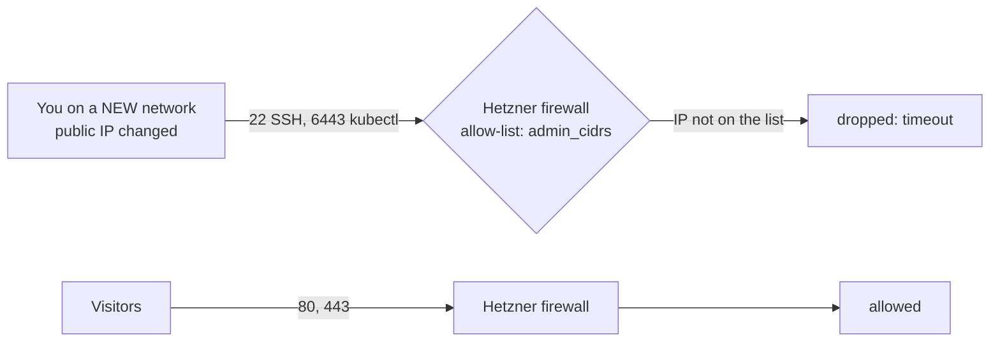

# Runbook: my IP address changed and I am locked out

**Use this when** `ssh`, `kubectl` or Ansible suddenly time out, but the website still
works. It happened to us on the first day (a switch to a different network), so it will
happen again.

A **runbook** is a short, tested checklist for a known problem. Follow it top to bottom.
More problems and their fixes are collected in `02-troubleshooting-log.md`.

---

## 1. Why it happens

The Hetzner firewall lets **SSH (port 22)** and the **Kubernetes API (port 6443)** in from
only the addresses listed in `admin_cidrs`. Everyone else is dropped. Your home or phone
network gives you a different public IP when you change networks (and mobile networks
change it often), so the firewall stops recognising you.

The website is **not** affected: ports 80 and 443 are open to everyone, so visitors are fine.



## 2. Recognise it

You see one of these, and **nothing else is wrong**:

- `kubectl`: `Unable to connect to the server: dial tcp <ip>:6443: i/o timeout` (or
  `context deadline exceeded`)
- `ssh`: hangs, then `Connection timed out`
- Ansible: `UNREACHABLE` with a timeout

Two quick tests, from your laptop:

```bash
curl -4 -s ifconfig.me; echo                 # your CURRENT public IP
grep admin_cidrs infra/terraform/envs/prod/terraform.tfvars    # the IPs the firewall allows
nc -z -G 5 <server-ip> 443 && echo "web: open"                 # should say open (web is public)
nc -z -G 5 <server-ip> 22  && echo "ssh: open" || echo "ssh: blocked"
```

If the first IP is **not** in the second list, and port 443 is open while 22 is blocked,
this is your problem.

**Try three times before you conclude anything.** A single timeout can be a brief network
blip (we saw one that cleared on its own). Run `kubectl get nodes` three times a few seconds
apart: if it works at least once, the firewall is fine and the network was flaky.

(A timeout means packets are being dropped silently. A **refusal** such as
`Connection refused` is a different problem: it means something answered and said no.)

## 3. Fix it

**A. Add the new IP to the allow-list.** Edit `infra/terraform/envs/prod/terraform.tfvars`
(a git-ignored file). Keep the old addresses if you still use those networks:

```hcl
admin_cidrs = ["203.0.113.7/32", "198.51.100.20/32"]   # old network, new network
```

The `/32` means "exactly this one address".

**B. Apply it.** Terraform talks to the Hetzner **API**, which the firewall does not block,
so this works even while you are locked out of the server:

```bash
hetzner                                   # load the secrets (see doc 01)
cd infra/terraform/envs/prod
terraform plan
```

Read the plan. It should show **1 to change** and nothing else: the firewall
(`module.firewall.hcloud_firewall.this`) gets new source addresses on the SSH and
Kubernetes API rules. Then:

```bash
terraform apply
```

**C. Update the CI copy.** The pipeline has its own copy of the list, so keep it in step or
its plan will show a pointless firewall difference:

```bash
gh secret set TF_VAR_ADMIN_CIDRS --repo <owner>/<repo>
# paste, with the brackets and quotes:  ["203.0.113.7/32", "198.51.100.20/32"]
```

**D. Check.**

```bash
kubectl get nodes          # Ready
ssh -i ~/.ssh/hetzner_portfolio bamise@<server-ip> hostname
```

It takes effect within a few seconds of the apply.

## 4. If you cannot run Terraform either

(For example, you lost your secrets.) Use the **Hetzner Cloud console** in a browser: open
the project, then **Firewalls**, edit the firewall's SSH and 6443 rules, and add your IP.
The change is instant.

This **bypasses Terraform**, so the code and the real firewall now disagree. Reconcile
later: put the same IP in `terraform.tfvars` and run `terraform apply`, or Terraform will
revert your console edit on the next apply.

## 5. Things to avoid

- **Do not set `admin_cidrs` to `0.0.0.0/0`.** The code refuses it on purpose; it would open
  SSH and the cluster API to the whole internet.
- **Do not widen to a big range** (an entire provider's block) to "fix it for good". It
  trades a nuisance for a real hole.
- **Check the IP you add is yours.** `curl -4 ifconfig.me` shows the address the internet
  sees. Behind a VPN it may be the VPN's address, which is not what you want to allow
  unless you always use that VPN.

## 6. Why this keeps happening, and the planned permanent fix

An allow-list of IP addresses suits a fixed address, and a laptop on changing networks is
the opposite. The fix is a **private tunnel with WireGuard**, after which nothing depends
on your IP. It is written and documented in `docs/infra/11-wireguard.md`; once it is rolled
out, use the tunnel (`ssh bamise@10.8.0.1`, `kubectl` at `https://10.8.0.1:6443`) and keep
this runbook as the fallback for when the tunnel itself is down.

| Option | Verdict |
|---|---|
| Update the IP by hand (this runbook) | Works today; a chore each time the network changes |
| **WireGuard** (self-hosted private tunnel) | **Chosen** (doc 11). No third party, no IP to track |
| Tailscale (hosted private network) | Easiest, but relies on their control server |
| Headscale (self-hosted Tailscale control server) | More to run, and it would live on the very server you need to reach |
| Open SSH to everyone | Not for the Kubernetes API; not recommended |
