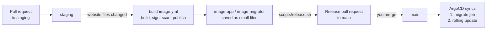

# Runbook: release a new version, and roll it back

**Use this when** a change is merged to `staging` and you want it live, or when a release
went wrong and you want the previous version back.

A **runbook** is a short checklist for a known job. Follow it top to bottom.

New words: a **digest** is a fingerprint of an image's contents (`sha256:...`). A tag
(`sha-8f7b6c4`) is only a label that someone could move; a digest cannot be moved, so the
cluster is told to run the digest. **ArgoCD** is the tool inside the cluster that makes it
match whatever is on the `main` branch.

---

## 1. How a release works



Merging the release pull request is the deployment. Nothing else deploys.

## 2. Release

1. Make sure the change is merged to `staging` and its **Build and publish images** run is
   green (Actions tab). A change that touches no website file builds nothing, so there is
   nothing to release.
2. From the repository, on any branch with a clean working tree:

   ```bash
   scripts/release.sh
   ```

   It takes the newest successful staging build, checks the signatures if `cosign` is
   installed, branches from `main`, writes `tag@digest` into both manifests
   (`30-deployment.yaml` and `20-migrate-job.yaml`) and opens the pull request. To release an
   older build, pass its run number: `scripts/release.sh 37239706932`.
3. Review the pull request (only two files, two lines) and wait for checks. **Merge with a
   merge commit, never squash.**
4. Watch it roll out (needs the WireGuard tunnel, doc 11, and the Hetzner kubectl context):

   ```bash
   kubectl -n portfolio get pods -w
   kubectl -n portfolio get pods -o jsonpath='{..image}'     # shows the digest now running
   curl -s https://oluwabamiseomolaso.com.ng/api/health
   ```

   The migration job runs first. Then pods are replaced one at a time and a new pod only
   receives visitors when its readiness probe passes, so a broken image never takes the site
   down: the old pods keep serving.

## 3. Roll back

Revert the release pull request on GitHub ("Revert" button), merge the revert pull request.
ArgoCD returns the cluster to the previous digest within a few minutes. (ArgoCD's own
"Rollback" button does nothing here because automatic sync is on and would undo it.)

**The database caveat.** Migrations only go forward. If the bad release included a database
migration, the old app now runs against the newer schema. That works when the migration only
*added* things (a new column or table). It can break when the migration removed or renamed
something. So: **write migrations in two steps** (add first; remove in a later release once
nothing uses it). If a release did remove something, restore from the backup (doc 06)
instead of relying on a revert.

**Not rehearsed yet.** Do one rehearsal when nothing important is happening: release, then
revert, and time it. Write the result below.

| Date | What was rehearsed | Time to recover | Notes |
|---|---|---|---|
| | | | |

## 4. After a release: keep `staging` in step

Releases only edit `main`, so the image tags in the manifests **on `staging` fall behind**.
That matters on the day you promote other changes from `staging` to `main` (for example
documentation or infrastructure files): a plain promotion would also carry the old image
tags and **roll the website back by accident**.

Avoid it by bringing `main` into `staging` after each release (a merge pull request from
`main` to `staging`), or, if you promote without doing that, check the pull request's file
list: it must not touch the two image lines unless you mean it to.
