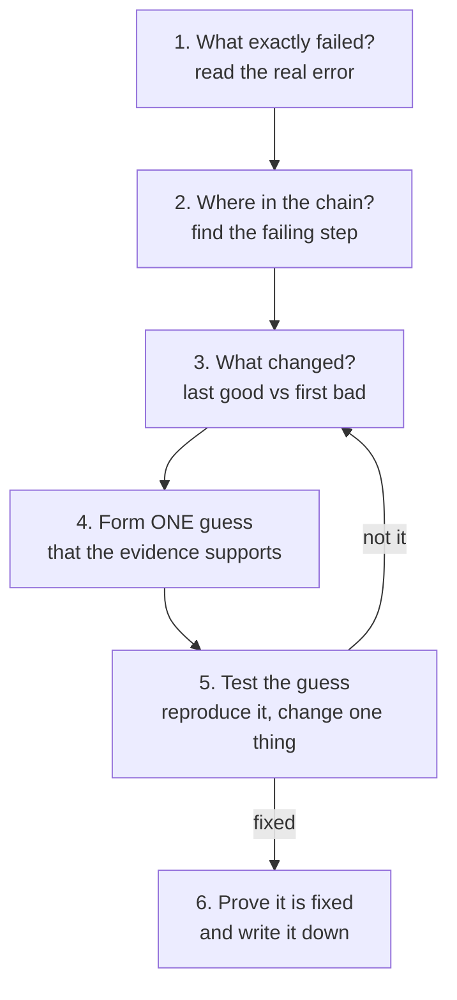

# How to find the problem

When you ask me a question about something broken, I follow the same loop every time. None of
it is magic. You can do all of it by hand.



## 1. Read the real error, do not guess

"The build failed" is not an error. The error is one specific line of text. Everything
starts by finding it.

For GitHub checks:

```bash
gh pr checks 104                          # which check is red
gh run view <run-id> --log-failed         # only the failing step's text
```

Then **search that text for the first thing that looks like a complaint**: the words `Error`,
`failed`, `FAIL`, `denied`, `not found`. The first error usually matters; the ones after it are
often side effects.

## 2. Find where in the chain it broke

Everything here is a chain. If you know which link broke, you have halved the problem.

| Chain | Links, in order |
|---|---|
| A change reaching the site | edit, pull request, checks, merge to `staging`, image build, manifests updated, promote to `main`, ArgoCD sync, new pods |
| A visitor loading a page | browser, Cloudflare, the server's firewall, ingress (the front door), the service, the pod running the app, the database |

A check is one link; inside it, each **step** is a smaller link. Example: the "Test Suite" check
ran its tests (passed) and then failed at "Upload coverage". That already says the tests are
fine and the problem is a network call to an outside service.

## 3. Ask what changed

Most things worked yesterday. So compare:

- **The last good run versus the first bad one.** `gh run list` shows the history; open both.
- **What the failing change touched.** `git diff --stat origin/staging` lists the files. A
  failure in code a pull request never touched usually means the environment, not the change.
- **Anything outside the repository.** A secret that was edited, a setting changed on GitHub,
  Cloudflare or Hetzner, your own IP address changing.

## 4. Make ONE guess the evidence supports

Do not try five fixes at once. If you do, and it works, you never learn which one did it, and
a wrong fix can hide the real problem. Write the guess as a sentence: "I think X, because the
log says Y." If you cannot say "because", it is not a guess yet, only a hope.

## 5. Test the guess, cheaply

Prefer the cheapest test that can prove the guess wrong:

- **Reproduce it on your own machine** (`npm test`, `npx tsc --noEmit`, `docker build`). A
  problem you can trigger on demand is almost solved.
- **Ask the system directly** instead of reasoning about it: `curl -i` for a web address,
  `kubectl describe pod` for a pod, `dig` for DNS.
- **Re-run once.** If it fails the same way twice, it is not random. If it passes, it was a
  flaky network or service.
- **Change one thing, then run the same test.**

## 6. Prove it is fixed, then write it down

"It should work now" is not proof. Run the exact check that failed and see it pass. Then add
a short entry to [04-case-files.md](04-case-files.md): what it looked like, what the evidence
was, the cause, the fix. The next person (or the next you) will recognise the pattern
in seconds.

## Habits that make this faster

- **Trust the order of the evidence.** First error first.
- **Separate "my change" from "the world".** Tests passing but an upload failing is the world.
- **Read the whole line.** Error lines often name the file and the line number.
- **After every edit, re-run the checks that CI will run** (type-check, tests, lint). Many
  failures here were caught late only because that was skipped.
- **When unsure, look; do not assume.** Before saying a setting is on, read it.
- **Say what you could not check.** "I cannot see inside the cluster from here" is a fact,
  and it tells you what you must check yourself.
